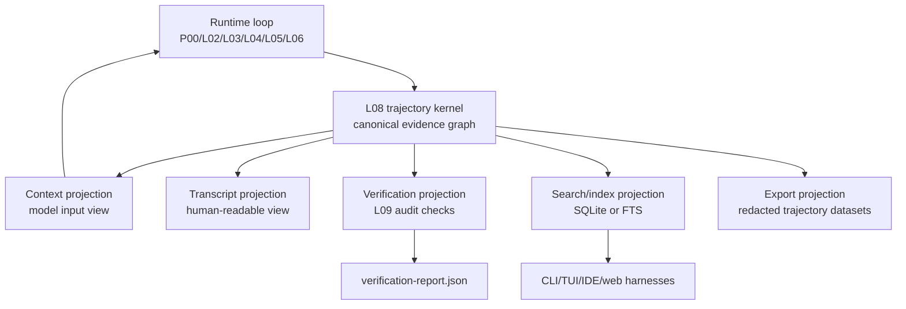

# L08 trajectory kernel contract

## Purpose

This document proposes the target L08 trajectory contract for this repo.

The goal is not to build a minimum product, chat history feature, or storage adapter first. The goal is to define the smallest research-grade contract that can explain, replay, resume, fork, and verify an agent run across CLI, TUI, IDE, web, and headless harnesses.

Trajectory is treated as a runtime evidence kernel:

```text
trajectory = canonical evidence of runtime state transitions
```

Transcript, model context, UI playback, search index, training export, and verification report are projections from that evidence. They must not become the only source of truth.

## Design Thesis

A better trajectory structure is not "JSONL instead of SQLite" or "messages table instead of event log."

The stronger claim is:

> L08 should define an append-only, replayable, branch-aware evidence graph. Storage formats are implementations. Context, transcript, verification, search, and export are projections.

This means the core design question is not where to store messages. The core design question is which runtime facts must be preserved so another process can reconstruct the same effective state without trusting the original loop's final report.

## Reference Direction

The L08 research compared four reference implementations. The design adopts direction, not full architecture, from each one.

| Reference | Direction Observed | Design Takeaway For This Repo |
| --- | --- | --- |
| openai/codex | Rollout/thread records are used to reconstruct effective history after compaction, rollback, interruption, and fork. | Do not trust a final transcript as canonical truth. Replay from durable events and reconstruction markers. |
| NousResearch/hermes-agent | SQLite session/message storage, FTS, counters, and parent-session lineage support search and operation. | DB storage is useful as a projection/index layer, but rewrite/soft-delete require explicit audit semantics. |
| XiaomiMiMo/MiMo-Code | Session/message/part tables combine with event sequence and projector-like sync events. | Long-term shape should be event-sourced with materialized projections and pair-aware message parts. |
| MoonshotAI/kimi-cli | `context.jsonl` and `wire.jsonl` separate model context restoration from visible/wire playback. | Separate canonical event evidence from context and display views. A simple file encoding is useful for inspection, not the whole architecture. |

The synthesis is:

```text
Codex reconstruction
+ Kimi context/wire separation
+ MiMo projector discipline
+ Hermes query/index pragmatism
= trajectory kernel + projections
```

## Layer Boundary

L08 owns:

- canonical trajectory event envelope
- append-only ordering and branch lineage
- replay cursor and reconstruction contract
- checkpoint, compaction, rollback, resume, and fork evidence
- tool-call/result and permission evidence
- references from projections back to source events
- storage-independent projection rebuild contract

L08 does not own:

- which context to send to a model; that is L02
- provider-specific request/stream conversion; that is L03
- tool schema validation details; that is L04
- actual tool execution side effects; that is L05
- permission policy decision; that is L06
- surface rendering or UI event styling; that is L07/L12
- final pass/fail judgment; that is L09

Boundary rule:

```text
L08 preserves evidence.
Other layers interpret evidence for their own purpose.
```

## Target Architecture



The kernel is the only canonical source. Every projection must declare which source events it covers and be rebuildable from the kernel.

## Canonical Event Envelope

The trajectory event envelope should be stable, provider-neutral, serializable, and branch-aware.

```ts
type TrajectoryEvent = {
  schemaVersion: number;
  id: string;
  runId: string;
  sessionId: string;
  turnId?: string;
  stepId?: string;
  seq: number;
  parentEventId?: string;
  previousEventId?: string;
  previousHash?: string;
  at: string;
  actor: "human" | "runtime" | "model" | "tool" | "harness" | "verifier";
  kind: string;
  payload: Record<string, unknown>;
  refs?: TrajectoryRef[];
  visibility: "public" | "internal" | "sensitive" | "redacted";
  redaction?: RedactionPolicy;
};
```

Field intent:

- `id`: stable event identity. Do not use array index as identity.
- `seq`: monotonic sequence within one linear ledger segment.
- `parentEventId`: causal parent. Needed for nested steps, tools, subagents, and verifier checks.
- `previousEventId` and `previousHash`: append-chain integrity. Needed for replay audit and corruption detection.
- `actor`: separates human input, runtime control, model output, tool effects, harness UI, and verifier judgment.
- `kind`: event type. Runtime-specific details stay in `payload`.
- `refs`: explicit links to covered events, source files, blobs, checkpoints, or projection records.
- `visibility` and `redaction`: preserve auditability without assuming every event is safe to export.

## Core Event Families

The first contract should define event families before exhaustive event names.

```text
Input
  HumanInputReceived
  HarnessContextProvided
  ExternalSourceAttached

Turn and step lifecycle
  TurnStarted
  StepStarted
  StopConditionEvaluated
  TurnCompleted
  TurnInterrupted
  TurnFailed

Context
  ContextViewRequested
  ContextViewBuilt
  ContextBudgetExceeded
  CheckpointCreated
  CompactionRequested
  CompactionCompleted

Model
  ModelRequestBuilt
  ModelStreamStarted
  ModelStreamDelta
  ModelResponseCompleted
  ModelError

Tool and permission
  ToolCallRequested
  ToolCallValidated
  PermissionRequested
  PermissionResolved
  ToolExecutionStarted
  ToolCompleted
  ToolFailed

Persistence and branching
  ResumeRequested
  ReplayStarted
  ReplayCompleted
  ForkCreated
  RollbackRecorded

Verification
  VerificationStarted
  InvariantChecked
  VerificationCompleted
```

The first executable prototype does not need to emit every event. The design contract should still reserve these categories so later code does not collapse unrelated concerns into one transcript record.

## Projections

Projection records are derived state. They may be stored for speed or inspection, but they are not canonical truth.

### Context Projection

Purpose: produce the L02 model input view.

Rules:

- Must reference source event ids.
- Must not contain orphaned tool results or orphaned assistant tool calls.
- Must record checkpoint and compaction ranges.
- Must distinguish provider-neutral messages from provider-specific request shapes.
- Must be rebuildable from the kernel plus configured context policy.

### Transcript Projection

Purpose: produce human-readable conversation playback.

Rules:

- May hide internal events by default.
- Must preserve a way to expand audit details.
- Must not become the resume source of truth.
- Must represent interruptions, approvals, tool failures, and compactions as visible state transitions when relevant.

### Verification Projection

Purpose: let L09 audit runtime claims.

Rules:

- Must read trajectory evidence rather than only `TurnReport`.
- Must record each invariant check with source event refs.
- Must distinguish "not verified" from "failed."
- Must be reproducible against stored fixtures.

### Search And Index Projection

Purpose: support resume UX, cross-session lookup, FTS, counters, lineage browsing, and operation.

Rules:

- SQLite/FTS belongs here unless a later ADR explicitly makes it canonical.
- Rebuild must be possible from trajectory ledger segments.
- Soft deletes and inactive messages must have audit events.
- Search result rows must link back to canonical event ids.

### Export Projection

Purpose: produce redacted trajectories for evaluation, training, or external review.

Rules:

- Redaction is explicit and event-backed.
- Export must declare which event ranges and projections it used.
- Reasoning, credentials, file contents, and tool outputs need separate visibility policies.

## Required Invariants

These invariants define "better trajectory" more precisely than any storage choice.

1. Event identity is stable and unique within a ledger.
2. `seq` has no gaps or duplicates within one linear segment.
3. Append-chain metadata is valid: `previousEventId` and `previousHash` match the prior event in that segment.
4. Every started turn has one terminal outcome unless it is explicitly waiting for external approval.
5. Every `ToolCallRequested` resolves to `ToolCompleted`, `ToolFailed`, or `PermissionResolved` with denial.
6. Every `ToolCompleted` or `ToolFailed` references an existing tool call.
7. Permission decisions reference both the requested action and the policy/harness decision source.
8. Context projections contain no orphaned tool-call or tool-result records.
9. Compaction records declare covered event range, preserved head/tail, summary provenance, and replacement refs.
10. Checkpoint records declare replay cursor, effective context boundary, and source event range.
11. Fork records declare parent event id, fork reason, and inherited projection boundary.
12. Resume records declare the replay cursor and the projection used to restart.
13. Verification reports cite event ids, not only final assistant text.
14. Redacted exports preserve event structure while removing or masking sensitive payload fields.

## Branching, Fork, And Resume

Fork is not file copy. Fork is a branch in the evidence graph.

```text
parent ledger segment
  e1 -> e2 -> e3 -> e4
                  \
                   fork event -> child segment c1 -> c2
```

Rules:

- A fork starts from a source event id, not from "current transcript text."
- The fork event records why the branch exists: user fork, interrupted turn, rollback, compaction child, or verifier replay.
- The child segment may reuse prior evidence by reference. It should not silently duplicate and mutate parent events.
- Resume must replay or validate the inherited event range before appending new events.

Resume is not appending to the last visible message. Resume is:

```text
load ledger -> validate chain -> rebuild projections -> choose replay cursor -> append new events
```

If replay cannot validate the required range, the runtime must fail closed or ask for repair. It must not silently continue from a corrupted context view.

## Compaction And Checkpoint

Compaction is a transform event, not transcript mutation.

`CompactionCompleted` must include:

- source event range
- source context projection id
- summary payload or blob ref
- preserved head/tail boundary
- tool-call/result pair boundary check
- compactor identity: fake, model, human, or deterministic rule
- replacement projection id

Checkpoint is a replay optimization, not canonical truth.

`CheckpointCreated` must include:

- source event range
- replay cursor
- projection ids covered
- state hash
- invalidation rule

## Storage Strategy

This design intentionally separates storage role from storage format.

Canonical role:

```text
trajectory ledger segment
```

Possible encodings:

- JSONL: best for early fixtures, inspection, diff, and deterministic tests.
- SQLite table: useful if an ADR later chooses DB as canonical for transaction and query reasons.
- Content-addressed blobs: useful for large payloads, screenshots, file snapshots, or tool outputs.

Projection role:

```text
context projection
transcript projection
verification projection
search/index projection
export projection
```

Likely encodings:

- JSON files for small deterministic fixtures.
- SQLite/FTS for search and session lists.
- Redacted JSONL for evaluation/export.

Current recommendation:

```text
canonical = append-only event ledger
inspection fixture = JSONL
query/index = SQLite projection
```

This is a design recommendation, not a product MVP. The first code prototype may use JSONL because it is inspectable, but the architecture must not confuse JSONL with L08 itself.

## Relationship To Current Prototype

The current `JsonlTrajectoryStore` should be treated as a research fixture, not the target architecture.

It is useful because it tests:

- event sequence persistence
- context/event separation
- independent verifier checks
- fake provider/fake tool replay evidence

It is incomplete because it does not yet provide:

- event ids
- hash-chain integrity
- branch-aware fork/resume
- replay reader
- projection registry
- compaction/checkpoint semantics
- transactional multi-file writes
- redaction policy

Future code should either evolve it toward the kernel contract or replace it with a cleaner `TrajectoryKernel` implementation.

## Research Validation Plan

This plan validates the contract before treating it as an implementation target.

1. Replay fixture:
   - Create a small hand-written ledger with user input, model tool call, permission, tool result, final answer.
   - Rebuild transcript and context projections from the ledger.
   - Verify tool pairing and terminal state.

2. Fork fixture:
   - Create a parent ledger and a child fork event.
   - Prove that the child can inherit parent events by reference without mutating the parent.

3. Compaction fixture:
   - Create a ledger with tool-call/result pairs around a compaction boundary.
   - Verify that compaction cannot split a pair.

4. Resume fixture:
   - Persist a partial interrupted turn.
   - Rebuild projection and append a continuation only after validation.

5. SQLite projection fixture:
   - Build an index from the ledger.
   - Delete the index.
   - Rebuild it from canonical events.

## Open Questions

- Should the canonical ledger be strictly linear per run, or should branch events make the ledger a DAG from the beginning?
- Should `previousHash` cover raw payload bytes, normalized JSON, or content-addressed blob refs?
- Which payload fields are always safe for transcript projection?
- Should model stream deltas be canonical events, or should only completed model messages be canonical with stream deltas as optional diagnostic events?
- How much provider raw metadata should be kept under L08 versus L03 debug artifacts?
- Should projection rebuild be synchronous in the runtime or delegated to a separate projector service?
- What is the minimal redaction policy that still preserves replay and verification?

## Design Acceptance Criteria

This design is ready to influence implementation only when:

- event envelope fields are accepted or explicitly revised
- projection boundaries are accepted
- required invariants are turned into verifier checks or test fixtures
- fork/resume/compaction semantics have at least one deterministic fixture each
- SQLite is either accepted as projection-only or promoted to canonical by a separate ADR

Until then, code should be described as exploratory prototype evidence, not the final L08 implementation.
