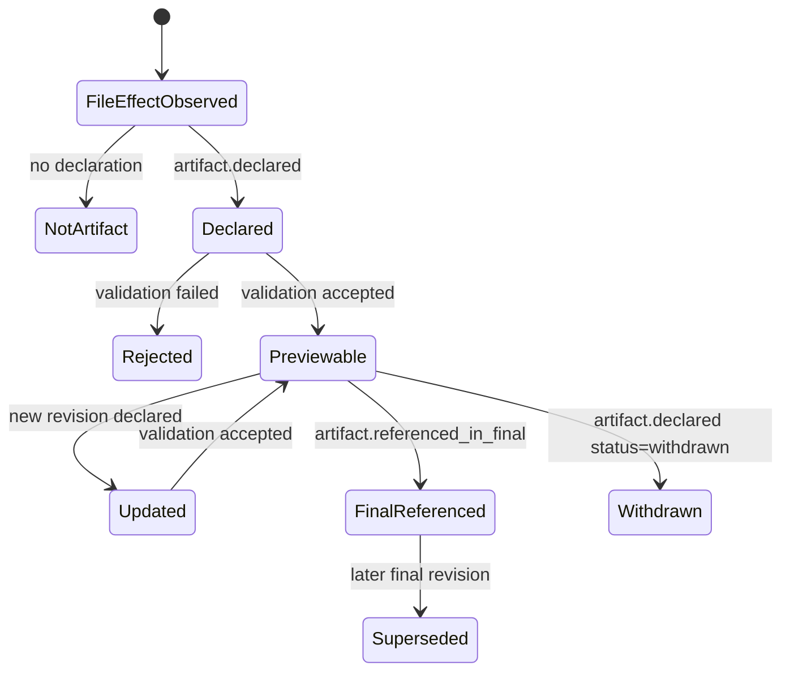

# Artifact Preview Contract

## Purpose

This contract defines how an agent runtime and human-facing app should handle files that can be previewed, especially Markdown, HTML, images, and report-like outputs.

The design separates four things that are easy to accidentally merge:

- a file was written
- a file can be previewed
- a file should be shown to the user during the turn
- a file is part of the final answer

The app may render previews, but the runtime must preserve explicit artifact intent in replayable events.

## Boundary Thesis

File effects are not artifacts.

An artifact is a declared user-facing or reviewer-facing output with provenance, stage, status, and rendering hints. The same physical file may be edited many times before one revision is declared as a preview artifact or final artifact.

Runtime owns:

- artifact declaration event schema
- validation result events
- artifact revision identity
- relation to turn, tool call, file effect, and final answer
- replay/fork/resume reconstruction

Harness owns:

- preview renderer selection
- sandboxed rendering
- preview panel/card layout
- opening files in editor/browser
- user controls such as pin, dismiss, compare revisions, download, or copy path

The agent may request artifact declaration, but it does not directly render preview UI.

## Non-Goals

- Do not promote every write to an artifact.
- Do not rely on free-form final-answer text as the only artifact contract.
- Do not make HTML preview trusted just because the file was produced by the agent.
- Do not mutate transcript history to fit preview UI.
- Do not make the app infer final deliverables only from file extensions.

## Core Event Types

### FileEffectObserved

Records that a tool, patch, or filesystem operation changed a file. This is evidence, not artifact promotion.

```ts
type FileEffectObserved = {
  type: "file.effect.observed";
  id: string;
  threadId: string;
  turnId: string;
  sourceItemId: string;
  toolCallId?: string;
  path: string;
  operation: "create" | "update" | "delete" | "rename" | "copy";
  diff?: string;
  contentHash?: string;
  observedAtMs: number;
};
```

### ArtifactDeclared

Declares that a file or URI should be treated as an artifact candidate.

```ts
type ArtifactDeclared = {
  type: "artifact.declared";
  id: string;
  threadId: string;
  turnId: string;
  sourceItemId: string;
  toolCallId?: string;

  location:
    | { kind: "workspacePath"; path: string }
    | { kind: "codexHomePath"; path: string }
    | { kind: "resourceUri"; uri: string };

  title: string;
  contentType:
    | "text/markdown"
    | "text/html"
    | "image/png"
    | "image/jpeg"
    | "application/pdf"
    | "application/json"
    | string;

  audience: "user" | "reviewer" | "agent";
  stage: "draft" | "review" | "final";
  status: "created" | "updated" | "ready" | "failed" | "withdrawn";
  includeInFinal: boolean;

  revision: number;
  contentHash?: string;
  byteSize?: number;

  rendererHint?: {
    preferred: "markdown" | "html" | "image" | "pdf" | "text" | "json";
    sandboxRequired: boolean;
  };

  declaredAtMs: number;
};
```

### ArtifactValidated

Records whether the runtime or harness accepted the declaration as renderable.

```ts
type ArtifactValidated = {
  type: "artifact.validated";
  id: string;
  artifactId: string;
  threadId: string;
  turnId: string;
  result: "accepted" | "rejected";
  reason?: string;
  validatedAtMs: number;
};
```

### ArtifactReferencedInFinal

Links final assistant text to the artifact revision that should appear as part of the final answer.

```ts
type ArtifactReferencedInFinal = {
  type: "artifact.referenced_in_final";
  id: string;
  artifactId: string;
  threadId: string;
  turnId: string;
  finalMessageItemId: string;
  revision: number;
  label: string;
  referencedAtMs: number;
};
```

## State Model



Rules:

- `FileEffectObserved` alone never creates a preview card.
- `ArtifactDeclared(stage="draft" | "review")` may create a side preview, but not a final attachment.
- `ArtifactDeclared(stage="final", includeInFinal=false)` means the artifact is final-quality but not part of the answer card.
- `ArtifactReferencedInFinal` is required for final-answer inclusion.
- If a file changes after final reference, the previous artifact revision remains final and the new file effect must not silently mutate the final artifact.

## Renderer Contract

The harness chooses a renderer from `contentType`, `location`, and validation outcome.

Renderer rules:

- Markdown: render sanitized Markdown; block raw script execution.
- HTML: render in sandboxed iframe or equivalent isolated preview; disable scripts/forms/external network by default unless a signed local policy allows it.
- Images: render from a validated local file or safe object URL; preserve path and dimensions when known.
- JSON/text: render as code/text with size limits.
- PDF: use a sandboxed document viewer when available; otherwise expose open/download affordance.

Preview cards must show:

- title
- artifact stage and status
- path or resource URI
- revision
- source turn/tool when available

Preview cards must not imply final delivery unless there is an `ArtifactReferencedInFinal` event.

## Agent Contract

Agents should declare artifacts only when the file is intended for human consumption.

Good declarations:

- `report.html` after a complete analysis report is ready for review
- `summary.md` after the agent wants the user to read a draft
- generated image after image bytes are saved
- `diagnostics.json` when it is the intended audit artifact

Bad declarations:

- every temporary scratch file
- source code files modified as part of implementation
- dependency lockfiles
- raw logs unless the user asked for logs as deliverables
- hidden intermediate prompts or provider payloads

Agent final answer rule:

- Mentioning a path in final prose is helpful but not authoritative.
- A final answer artifact must be linked by `ArtifactReferencedInFinal`.
- If the artifact is important but not final, the final answer may say it remains a draft/review artifact.

## App Flow

1. Receive `FileEffectObserved` or app-server-style `FileChange`.
2. Update file-change/activity UI.
3. If `ArtifactDeclared` arrives, validate:
   - path is inside an allowed root or URI uses an allowed scheme
   - file exists when location is path-based
   - byte size is under preview limits
   - content type is allowed
   - HTML policy is safe enough for sandbox preview
4. Emit or store `ArtifactValidated`.
5. Render a preview affordance only after accepted validation.
6. On final answer, render final artifact cards only for `ArtifactReferencedInFinal`.
7. On resume/fork/replay, reconstruct preview state from artifact events, not from current filesystem guesses alone.

## Security Rules

- Treat HTML artifacts as untrusted.
- Never execute scripts from agent-authored HTML by default.
- Do not auto-fetch external resources from HTML preview.
- Resolve symlinks before validating workspace-local paths.
- Keep deleted or missing artifact files visible as broken references instead of silently dropping history.
- Redact or block artifacts whose path or content violates local policy.
- Do not include secret-bearing files in final cards unless the user explicitly requested that artifact and policy allows it.

## Persistence And Replay

Artifact events are append-only.

Replay must be able to answer:

- Which files were merely changed?
- Which changed files were declared as artifacts?
- Which artifact revision was previewed?
- Which artifact revision was included in the final response?
- Which artifact declarations failed validation?

Fork behavior:

- Fork copies artifact events up to the fork point.
- If the fork edits the same file, it creates a new revision in the forked thread.
- Final references from the source thread stay attached to the source turn unless explicitly re-declared in the fork.

Resume behavior:

- Resume reconstructs artifact state from events.
- If the file is missing, show a stale/missing artifact state rather than inventing a new artifact from the current file tree.

## Testing Requirements

Minimum deterministic tests:

- file write without artifact declaration does not create preview card
- Markdown artifact declaration creates a draft preview card
- HTML artifact declaration uses sandboxed renderer
- final response text with a path but no `ArtifactReferencedInFinal` does not create final artifact card
- `ArtifactReferencedInFinal` links the exact revision, not the latest file content
- changing a file after final reference creates a new non-final revision
- invalid path outside workspace is rejected
- missing file on resume renders a stale/missing artifact state
- fork preserves old artifact events but new edits get fork-local revisions

## Implementation Order

1. Add event contract types under `src/contracts/`.
2. Add replay/projection support so artifact state is derived from events.
3. Add a fake tool that writes Markdown/HTML and optionally declares artifacts.
4. Add deterministic tests for preview and final-reference behavior.
5. Add harness renderer stubs for Markdown, HTML, image, JSON/text.
6. Add UI affordances only after the event model is replayable.

## Decision

Adopt explicit artifact declaration and final-reference events.

Do not infer preview artifacts from every file write. Do not infer final answer artifacts from path mentions in final prose. The app may offer convenience suggestions for previewable files, but first-class artifact UI must be driven by declared, validated, replayable artifact events.
