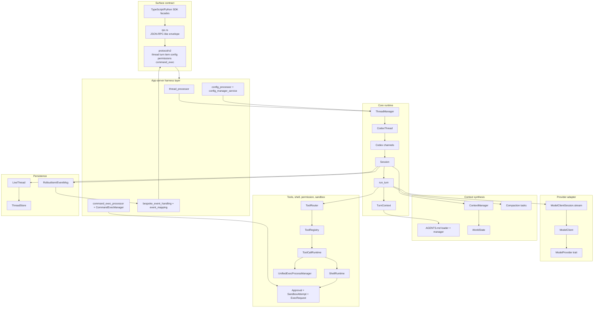
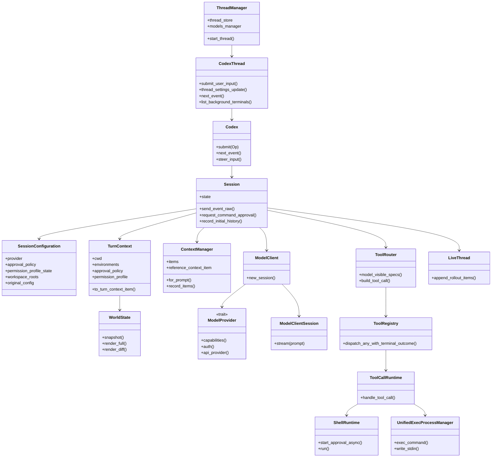
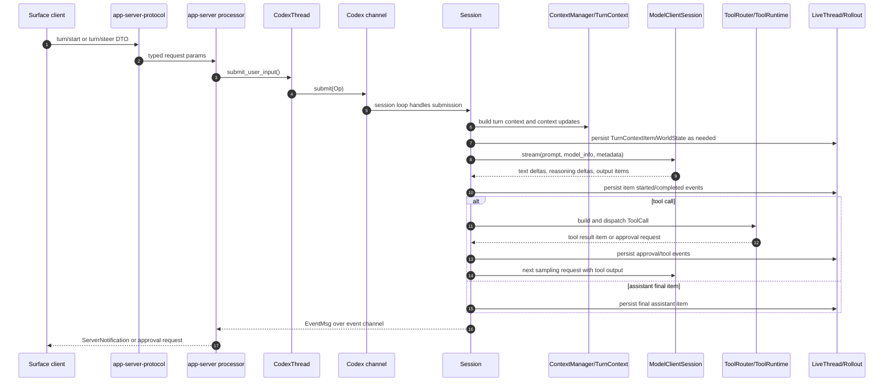
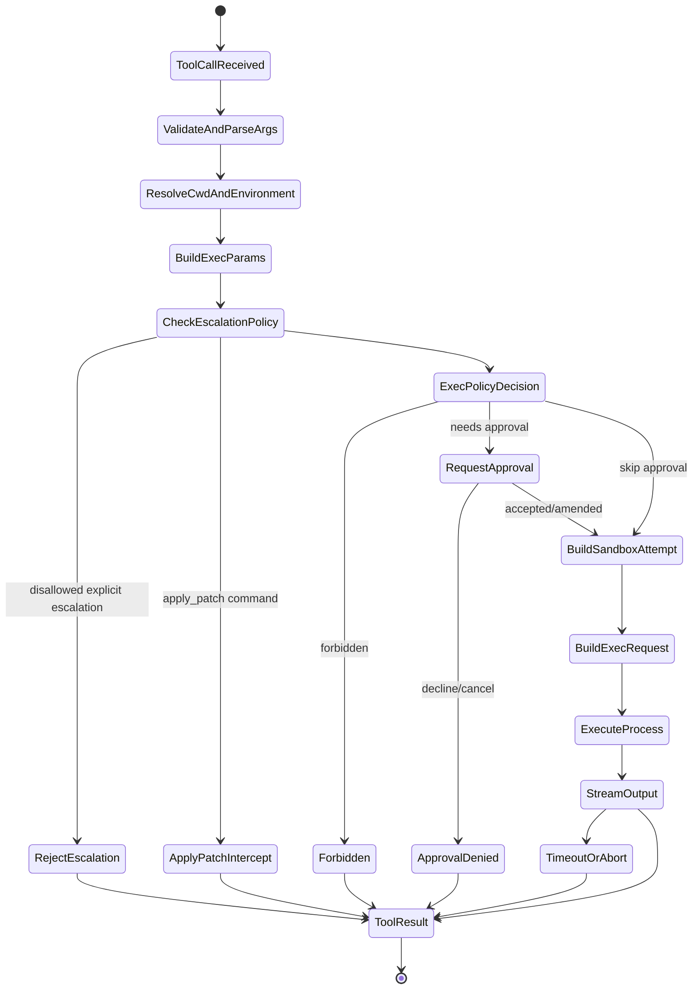
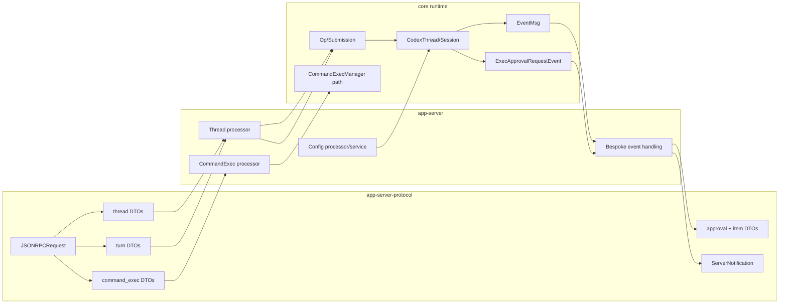

# Codex Implementation UML Review

## Scope and Exclusions

This review summarizes the Codex implementation that is present inside this repository snapshot, with evidence restricted to local files under the current repo.

Confirmed source boundary:

- Current repo: `/Users/potablepotato/HansolProduct/potato-project/theAgent`.
- Reviewed Codex checkout: `work/external-repos/openai__codex`, recorded by the source card as `https://github.com/openai/codex`, accessed on `2026-06-25`, with reviewed commit `c38b2e9ba69cb57d197c6e5ba78b5e52ae0870f9` and latest commit subject `Test executor-routed MCP OAuth token exchange (#29656)` (`01_sources/open-source/github/openai__codex/2026-06-25/source-card.md:27`, `01_sources/open-source/github/openai__codex/2026-06-25/source-card.md:30`, `01_sources/open-source/github/openai__codex/2026-06-25/source-card.md:32`).
- The source card marks `.codegraph/` as a discovery aid, not source evidence (`01_sources/open-source/github/openai__codex/2026-06-25/source-card.md:33`).

Included areas:

- Surface contract exposed by `codex-rs/app-server-protocol`, app-server request processors, SDK entrypoints, and their connection to core runtime.
- Runtime session/thread/turn orchestration in `codex-rs/core`.
- Provider adapter boundary in `codex-rs/model-provider` and `codex-rs/core/src/client*.rs`.
- Context synthesis, including AGENTS/project instructions, turn context, context manager, world state, and compaction.
- Config/settings loading and policy requirements in `codex-rs/config`, app-server config services, and core config projection.
- Tool execution, shell control, permissions, sandboxing, event/transcript/session persistence, and first-class runtime objects.

Excluded areas:

- TUI implementation. TUI-adjacent config fields are mentioned only when needed to classify scope, not to analyze TUI behavior.
- Codex-specific skill/plugin implementation internals, including bodies under `.codex/skills` or personal/plugin skill directories. Runtime references to skills/plugins are treated only as injection or manager boundaries.
- External clone, download, install, or live web verification.

## Source Inventory

| Area | Primary files | Evidence |
| --- | --- | --- |
| Repo contract | `AGENTS.md`, `docs/harness/*` | The work loop requires inspect, intake, context refresh, execute, verify, recover, report (`AGENTS.md:92`). The runtime/harness split is explicitly named and says runtime owns state machine, provider-neutral message/event types, context transform pipeline, provider adapter interface, tool registry, permission request emission, event emission, transcript append/replay, abort/timeout, and deterministic hooks (`AGENTS.md:199`, `AGENTS.md:203`). Harness owns human input, rendering, approval prompts, file picker, session UI, credential UX, and file-root/container lifecycle UI (`AGENTS.md:218`). The policy doc requires local/source-card preference and explicit approval for outside writes, destructive actions, external service mutation, or network dependency operations (`docs/harness/policy.md:12`, `docs/harness/policy.md:22`, `docs/harness/policy.md:62`). |
| Source card | `01_sources/open-source/github/openai__codex/2026-06-25/source-card.md` | Confirms the local checkout path, commit, and reviewed source set (`01_sources/open-source/github/openai__codex/2026-06-25/source-card.md:25`, `01_sources/open-source/github/openai__codex/2026-06-25/source-card.md:31`, `01_sources/open-source/github/openai__codex/2026-06-25/source-card.md:53`). |
| Runtime session/thread | `codex-rs/core/src/session/session.rs`, `session/mod.rs`, `codex_thread.rs`, `thread_manager.rs`, `session/turn.rs` | `Session` is the initialized model-agent context and permits at most one running task at a time (`work/external-repos/openai__codex/codex-rs/core/src/session/session.rs:23`). `Codex` exposes submissions and events over channels (`work/external-repos/openai__codex/codex-rs/core/src/session/mod.rs:393`). `CodexThread` wraps a `Codex`, session source, configured event, and rollout path (`work/external-repos/openai__codex/codex-rs/core/src/codex_thread.rs:158`). `ThreadManager` creates and maintains in-memory threads (`work/external-repos/openai__codex/codex-rs/core/src/thread_manager.rs:176`). `run_turn` is the user-turn loop that samples the model and runs tools until no follow-up is needed (`work/external-repos/openai__codex/codex-rs/core/src/session/turn.rs:129`, `work/external-repos/openai__codex/codex-rs/core/src/session/turn.rs:220`). |
| Provider adapter | `codex-rs/model-provider/src/provider.rs`, `codex-rs/core/src/client_common.rs`, `codex-rs/core/src/client.rs` | `ModelProvider` is the runtime provider abstraction (`work/external-repos/openai__codex/codex-rs/model-provider/src/provider.rs:96`). Provider capabilities include namespace tools, image generation, and web search (`work/external-repos/openai__codex/codex-rs/model-provider/src/provider.rs:28`). `Prompt` carries provider-neutral input, tools, base instructions, schema, and parallel-tool flag (`work/external-repos/openai__codex/codex-rs/core/src/client_common.rs:18`). `ModelClient` lives for a Codex session while `ModelClientSession` is turn-scoped (`work/external-repos/openai__codex/codex-rs/core/src/client.rs:1`, `work/external-repos/openai__codex/codex-rs/core/src/client.rs:243`). |
| Context synthesis | `codex-rs/core/src/agents_md.rs`, `agents_md_manager.rs`, `session/turn_context.rs`, `context_manager/history.rs`, `context_manager/updates.rs`, `context/world_state/mod.rs`, `compact.rs` | AGENTS.md discovery walks from cwd to root and collects root-to-cwd instructions (`work/external-repos/openai__codex/codex-rs/core/src/agents_md.rs:1`). `TurnContext` carries cwd, environments, current date/timezone, instructions, collaboration, approval, permission profile, network, sandbox, models, dynamic tools, and extension data (`work/external-repos/openai__codex/codex-rs/core/src/session/turn_context.rs:100`). `ContextManager` stores transcript items, token info, reference context, and world-state baseline (`work/external-repos/openai__codex/codex-rs/core/src/context_manager/history.rs:36`). Context update building has an explicit TODO that not every model-visible setting is covered yet (`work/external-repos/openai__codex/codex-rs/core/src/context_manager/updates.rs:235`). Compaction replaces history with a `ContextCompaction` item and can reinject initial context (`work/external-repos/openai__codex/codex-rs/core/src/compact.rs:55`, `work/external-repos/openai__codex/codex-rs/core/src/compact.rs:220`). |
| Config/settings | `codex-rs/config/src/*`, `codex-rs/core/src/config/mod.rs`, `codex-rs/app-server/src/config_manager*.rs` | Config layer sources include MDM, system, enterprise managed, user, project, and session flags (`work/external-repos/openai__codex/codex-rs/config/src/config_layer_source.rs:4`). Loader order includes admin, system, cloud, user, profile, cwd, tree, repo, and runtime/session layers (`work/external-repos/openai__codex/codex-rs/config/src/loader/mod.rs:94`). Project-local config denylist blocks fields such as `model_provider`, `model_providers`, `notify`, and profiles (`work/external-repos/openai__codex/codex-rs/config/src/loader/mod.rs:58`). App-server config edits only write to the allowed user config path (`work/external-repos/openai__codex/codex-rs/app-server/src/config_manager_service.rs:198`). |
| Tools and shell | `codex-rs/core/src/tools/router.rs`, `parallel.rs`, `registry.rs`, `handlers/shell*.rs`, `runtimes/shell.rs`, `unified_exec/*`, `exec.rs`, `app-server/src/command_exec.rs` | `ToolRouter` owns registry and model-visible specs (`work/external-repos/openai__codex/codex-rs/core/src/tools/router.rs:28`). Shell command args become `ExecParams` with command, cwd, timeout, environment, sandbox permissions, Windows sandbox, and justification (`work/external-repos/openai__codex/codex-rs/core/src/tools/handlers/shell/shell_command.rs:86`). `run_exec_like` applies env overrides, approval logic, apply-patch interception, and `ToolOrchestrator` shell execution (`work/external-repos/openai__codex/codex-rs/core/src/tools/handlers/shell.rs:80`, `work/external-repos/openai__codex/codex-rs/core/src/tools/handlers/shell.rs:168`, `work/external-repos/openai__codex/codex-rs/core/src/tools/handlers/shell.rs:204`). Unified exec supports interactive sessions with streaming output and later stdin writes (`work/external-repos/openai__codex/codex-rs/core/src/unified_exec/mod.rs:1`, `work/external-repos/openai__codex/codex-rs/core/src/unified_exec/process_manager.rs:441`). |
| Permission/sandbox | `codex-rs/core/src/tools/sandboxing.rs`, `codex-rs/core/src/sandboxing/mod.rs`, `codex-rs/core/src/session/session.rs` | Approval and sandbox traits are separated from execution (`work/external-repos/openai__codex/codex-rs/core/src/tools/sandboxing.rs:1`). `ExecApprovalRequirement` distinguishes skip, needs approval, and forbidden (`work/external-repos/openai__codex/codex-rs/core/src/tools/sandboxing.rs:160`). `Session::request_command_approval` emits an approval request event and awaits a decision (`work/external-repos/openai__codex/codex-rs/core/src/session/session.rs:2082`). `ExecRequest` derives filesystem and network sandbox policies from the permission profile (`work/external-repos/openai__codex/codex-rs/core/src/sandboxing/mod.rs:70`). |
| Persistence/events | `codex-rs/core/src/session/session.rs`, `codex-rs/core/src/thread_manager.rs`, `codex-rs/core/src/context_manager/history.rs`, `codex-rs/app-server-protocol/src/protocol/event_mapping.rs` | Session startup creates or resumes a `LiveThread`, persists metadata, and emits `SessionConfigured` (`work/external-repos/openai__codex/codex-rs/core/src/session/session.rs:563`, `work/external-repos/openai__codex/codex-rs/core/src/session/session.rs:1111`). Events are persisted as rollout items before being sent over the event channel (`work/external-repos/openai__codex/codex-rs/core/src/session/session.rs:1888`). Thread store is local or in-memory based on config (`work/external-repos/openai__codex/codex-rs/core/src/thread_manager.rs:264`). Core events are mapped to v2 server notifications by `item_event_to_server_notification` (`work/external-repos/openai__codex/codex-rs/app-server-protocol/src/protocol/event_mapping.rs:25`). |
| Surface contract | `codex-rs/app-server-protocol/src/rpc.rs`, `protocol/v2/*.rs`, `app-server/src/request_processors/*.rs`, `sdk/typescript/src/*.ts` | The app-server protocol is JSON-RPC-like but explicitly not true JSON-RPC 2.0 because it has no `jsonrpc` field (`work/external-repos/openai__codex/codex-rs/app-server-protocol/src/rpc.rs:1`). V2 exports thread, turn, item, config, permissions, command exec, and related modules (`work/external-repos/openai__codex/codex-rs/app-server-protocol/src/protocol/v2/mod.rs:1`). `ThreadStartParams` and `TurnStartParams` expose model, cwd, approval, sandbox, permission, environment, and runtime-root fields (`work/external-repos/openai__codex/codex-rs/app-server-protocol/src/protocol/v2/thread.rs:48`, `work/external-repos/openai__codex/codex-rs/app-server-protocol/src/protocol/v2/turn.rs:68`). TypeScript SDK starts and resumes threads through `CodexExec` and `Thread` (`work/external-repos/openai__codex/sdk/typescript/src/codex.ts:9`). |
| Tests | `codex-rs/core/src/session/tests.rs`, `rollout_reconstruction_tests.rs`, `context_manager/history_tests.rs`, `tools/runtimes/shell_tests.rs`, `tools/network_approval_tests.rs`, `app-server-protocol/src/protocol/v2/tests.rs` | Resume/fork reconstruction tests exist in session tests (`work/external-repos/openai__codex/codex-rs/core/src/session/tests.rs:1705`, `work/external-repos/openai__codex/codex-rs/core/src/session/tests.rs:2701`). Shell runtime and network approval tests are present (`work/external-repos/openai__codex/codex-rs/core/src/tools/runtimes/shell_tests.rs:36`, `work/external-repos/openai__codex/codex-rs/core/src/tools/network_approval_tests.rs:299`). Protocol v2 tests cover command exec params and output-delta round trips (`work/external-repos/openai__codex/codex-rs/app-server-protocol/src/protocol/v2/tests.rs:789`, `work/external-repos/openai__codex/codex-rs/app-server-protocol/src/protocol/v2/tests.rs:1400`). Tests were inventoried, not executed, because this task requested documentation only. |

## Layer Model

The implementation separates the externally visible app-server protocol, the app-server processors, and the core runtime. The following ownership model is confirmed by source, while the layer names are this review's interpretation of the structure.

| Layer | Owns | Does not own | Evidence |
| --- | --- | --- | --- |
| Surface contract | Request/notification/DTO shape, thread/turn/config/permission/item/command-exec schemas, SDK event facade | Runtime state machine, provider calls, shell execution | The protocol module exports v2 DTO modules (`work/external-repos/openai__codex/codex-rs/app-server-protocol/src/protocol/v2/mod.rs:1`). RPC messages are request, notification, response, and error envelopes (`work/external-repos/openai__codex/codex-rs/app-server-protocol/src/rpc.rs:34`). |
| App-server orchestration | Request processors, config service, command-exec manager, event mapping, approval request routing to clients | Core model loop semantics | Config processor maps config requests and clears plugin/skill caches after mutation (`work/external-repos/openai__codex/codex-rs/app-server/src/request_processors/config_processor.rs:57`, `work/external-repos/openai__codex/codex-rs/app-server/src/request_processors/config_processor.rs:170`). Bespoke event handling maps core events to server notifications and approval requests (`work/external-repos/openai__codex/codex-rs/app-server/src/bespoke_event_handling.rs:139`, `work/external-repos/openai__codex/codex-rs/app-server/src/bespoke_event_handling.rs:558`). |
| Thread/session runtime | Thread creation, `Codex` submission/event channel, `Session`, turn execution, settings updates, event persistence, rollout reconstruction | Surface protocol DTO definitions | `ThreadManager` creates and maintains threads (`work/external-repos/openai__codex/codex-rs/core/src/thread_manager.rs:176`). `Codex::spawn` builds the session, channels, and background submission loop (`work/external-repos/openai__codex/codex-rs/core/src/session/mod.rs:477`, `work/external-repos/openai__codex/codex-rs/core/src/session/mod.rs:658`). |
| Provider adapter | Provider capabilities, auth/account state, provider info, model client/session streaming | Agent loop and tool execution | The `ModelProvider` trait says implementations own provider-specific behavior and expose provider info (`work/external-repos/openai__codex/codex-rs/model-provider/src/provider.rs:96`). The turn loop calls `client_session.stream(...)` through a provider-neutral prompt (`work/external-repos/openai__codex/codex-rs/core/src/session/turn.rs:1887`). |
| Context pipeline | AGENTS/project instructions, turn context, world-state snapshots/diffs, history normalization, compaction | UI rendering and transcript mutation for window fitting | AGENTS.md instructions are read and wrapped as contextual user fragments (`work/external-repos/openai__codex/codex-rs/core/src/agents_md.rs:238`, `work/external-repos/openai__codex/codex-rs/core/src/agents_md.rs:380`). `ContextManager::for_prompt` normalizes prompt history and strips unsupported images (`work/external-repos/openai__codex/codex-rs/core/src/context_manager/history.rs:137`). |
| Tool and shell runtime | Tool registry/router, tool-call futures, shell exec, unified exec processes, sandbox attempts, streaming output | Human approval UI | `ToolRegistry` dispatches a tool invocation and emits terminal outcomes (`work/external-repos/openai__codex/codex-rs/core/src/tools/registry.rs:401`). `ShellRuntime` starts approval asynchronously through the session and builds sandbox execution (`work/external-repos/openai__codex/codex-rs/core/src/tools/runtimes/shell.rs:126`, `work/external-repos/openai__codex/codex-rs/core/src/tools/runtimes/shell.rs:243`). |
| Persistence/event log | Live thread, rollout items, context update items, world-state baseline, transcript reconstruction | Provider API transport | `send_event_raw` appends a rollout item and then sends over `tx_event` (`work/external-repos/openai__codex/codex-rs/core/src/session/session.rs:1888`). Initial history can reconstruct resumed or forked sessions (`work/external-repos/openai__codex/codex-rs/core/src/session/session.rs:1272`). |

## Runtime Flow

Confirmed turn-level flow:

1. A surface request starts or resumes a thread through app-server protocol DTOs. `ThreadStartParams` carries model, provider, cwd, approval, sandbox, permission, environment, dynamic tools, and raw-item options (`work/external-repos/openai__codex/codex-rs/app-server-protocol/src/protocol/v2/thread.rs:48`). `TurnStartParams` carries user input plus additional context, environments, cwd, runtime roots, approval, sandbox, permission, model, service tier, effort, summary, personality, output schema, collaboration, and multi-agent toggles (`work/external-repos/openai__codex/codex-rs/app-server-protocol/src/protocol/v2/turn.rs:68`).
2. `ThreadManager` starts a `CodexThread`, loading model managers, plugin/MCP/skill managers, a thread store, and config managers as needed (`work/external-repos/openai__codex/codex-rs/core/src/thread_manager.rs:294`, `work/external-repos/openai__codex/codex-rs/core/src/thread_manager.rs:618`).
3. `Codex::spawn_internal` creates submission and event channels, resolves exec policy manager inheritance or loading, builds a `SessionConfiguration`, creates a `Session`, and spawns the submission loop (`work/external-repos/openai__codex/codex-rs/core/src/session/mod.rs:503`, `work/external-repos/openai__codex/codex-rs/core/src/session/mod.rs:621`, `work/external-repos/openai__codex/codex-rs/core/src/session/mod.rs:658`).
4. `Session::new` creates or resumes a live thread, records metadata, configures model/client/environment state, emits `SessionConfigured`, and records initial history according to whether the source is new, cleared, resumed, or forked (`work/external-repos/openai__codex/codex-rs/core/src/session/session.rs:563`, `work/external-repos/openai__codex/codex-rs/core/src/session/session.rs:1111`, `work/external-repos/openai__codex/codex-rs/core/src/session/session.rs:1272`).
5. The turn loop uses `new_turn_context_from_configuration` to build a turn context, primary environment, effective per-turn config, model info, available plugins/skills snapshots, and optional git enrichment (`work/external-repos/openai__codex/codex-rs/core/src/session/turn_context.rs:671`).
6. `run_turn` runs pre-sampling compaction if needed, captures the current step context, records context updates and a reference context item, builds the prompt from `ContextManager::for_prompt`, and streams the model (`work/external-repos/openai__codex/codex-rs/core/src/session/turn.rs:150`, `work/external-repos/openai__codex/codex-rs/core/src/session/turn.rs:167`, `work/external-repos/openai__codex/codex-rs/core/src/session/turn.rs:220`, `work/external-repos/openai__codex/codex-rs/core/src/session/turn.rs:1887`).
7. Output items are classified as tool calls or assistant items. Tool calls are transformed by `ToolRouter` and scheduled through `ToolCallRuntime`; non-tool items are recorded and emitted as item events (`work/external-repos/openai__codex/codex-rs/core/src/stream_events_utils.rs:404`, `work/external-repos/openai__codex/codex-rs/core/src/stream_events_utils.rs:445`).
8. Tool results are converted back to response input items, causing another model sampling cycle when follow-up is needed (`work/external-repos/openai__codex/codex-rs/core/src/tools/parallel.rs:63`, `work/external-repos/openai__codex/codex-rs/core/src/session/turn.rs:293`).
9. Events are persisted to rollout before being sent to the event receiver; app-server event handling maps core events to server notifications or approval requests (`work/external-repos/openai__codex/codex-rs/core/src/session/session.rs:1888`, `work/external-repos/openai__codex/codex-rs/app-server/src/bespoke_event_handling.rs:139`).

## Surface Contract Model

The app-server surface is a typed, v2 protocol over a JSON-RPC-like envelope. It is not strict JSON-RPC 2.0 because the envelope omits a `jsonrpc` field (`work/external-repos/openai__codex/codex-rs/app-server-protocol/src/rpc.rs:1`). The top-level envelope distinguishes request, notification, response, and error (`work/external-repos/openai__codex/codex-rs/app-server-protocol/src/rpc.rs:34`).

Key external contracts:

| Contract | Shape | Runtime bridge | Evidence |
| --- | --- | --- | --- |
| Thread start/resume/fork/settings | `ThreadStartParams`, `ThreadStartResponse`, `ThreadSettingsUpdateParams`, thread notifications | App-server thread processor creates or updates `CodexThread` and core `SessionSettingsUpdate` | DTO fields expose model, provider, cwd, runtime roots, approval, sandbox, permission, config, environments, and dynamic tools (`work/external-repos/openai__codex/codex-rs/app-server-protocol/src/protocol/v2/thread.rs:48`, `work/external-repos/openai__codex/codex-rs/app-server-protocol/src/protocol/v2/thread.rs:157`, `work/external-repos/openai__codex/codex-rs/app-server-protocol/src/protocol/v2/thread.rs:200`). `CodexThread::thread_settings_update` converts settings into a core session update (`work/external-repos/openai__codex/codex-rs/core/src/codex_thread.rs:356`). |
| Turn start/steer/interrupt | `TurnStartParams`, `TurnSteerParams`, `TurnInterruptParams` | `CodexThread::submit_user_input`, active turn steering, core submission loop | Turn DTO fields include additional context, environment overrides, approval/sandbox/permissions, model settings, collaboration, and multi-agent (`work/external-repos/openai__codex/codex-rs/app-server-protocol/src/protocol/v2/turn.rs:68`). `CodexThread` starts a turn only if idle, not queued, and not in Plan mode (`work/external-repos/openai__codex/codex-rs/core/src/codex_thread.rs:305`). Active input can be steered into the session (`work/external-repos/openai__codex/codex-rs/core/src/session/mod.rs:794`). |
| Approval requests | `CommandExecutionRequestApprovalParams`, `CommandExecutionApprovalDecision`, `FileChangeRequestApprovalParams` | Core emits `ExecApprovalRequestEvent` or patch approval event; app-server sends request and routes response | Approval decision values include accept, accept for session, exec policy amendment, network rule amendment, decline, and cancel (`work/external-repos/openai__codex/codex-rs/app-server-protocol/src/protocol/v2/item.rs:45`). Command approval params include thread, turn, item, environment, reason, network context, command, cwd, available decisions, and amendments (`work/external-repos/openai__codex/codex-rs/app-server-protocol/src/protocol/v2/item.rs:1327`). Core emits the request and waits for a response (`work/external-repos/openai__codex/codex-rs/core/src/session/session.rs:2082`). |
| Event stream | `ServerNotification`, item events, turn events, thread events | `EventMsg` is persisted and mapped into v2 notification types | Event mapping starts from a single core `EventMsg` (`work/external-repos/openai__codex/codex-rs/app-server-protocol/src/protocol/event_mapping.rs:25`). App-server sends notifications to all relevant connections (`work/external-repos/openai__codex/codex-rs/app-server/src/outgoing_message.rs:553`). |
| Standalone command exec | `command/exec`, `command/writeStdin`, `command/terminate`, output deltas | App-server `CommandExecManager`, not a normal model-selected tool call | Protocol docs state `command/exec` runs a standalone command in the server sandbox without a thread/turn and returns a final response after output-delta notifications (`work/external-repos/openai__codex/codex-rs/app-server-protocol/src/protocol/v2/command_exec.rs:21`). The processor validates params and builds `ExecParams` (`work/external-repos/openai__codex/codex-rs/app-server/src/request_processors/command_exec_processor.rs:98`, `work/external-repos/openai__codex/codex-rs/app-server/src/request_processors/command_exec_processor.rs:291`). |
| Thread shell command | `thread/shellCommand` | Core `Op::RunUserShellCommand` and `UserShellCommandTask` | Protocol docs state this path preserves shell syntax and runs unsandboxed with full access instead of inheriting thread sandbox policy (`work/external-repos/openai__codex/codex-rs/app-server-protocol/src/protocol/v2/thread.rs:931`). App-server comments call it a local-host shell escape hatch, not the normal turn-selected shell tool path (`work/external-repos/openai__codex/codex-rs/app-server/src/request_processors/thread_processor.rs:1825`). |

## Context Synthesis

Confirmed inputs and assembly points:

- Base instructions are resolved during `Codex::spawn_internal`: config override takes priority, then conversation-history session metadata, then model instructions (`work/external-repos/openai__codex/codex-rs/core/src/session/mod.rs:570`).
- Prompt fragments are separated into developer sections and contextual user sections by `PromptSlot` (`work/external-repos/openai__codex/codex-rs/core/src/session/mod.rs:940`).
- Project instructions are discovered by walking from cwd to the configured project root marker and collecting candidate instruction files root-to-cwd (`work/external-repos/openai__codex/codex-rs/core/src/agents_md.rs:1`, `work/external-repos/openai__codex/codex-rs/core/src/agents_md.rs:147`, `work/external-repos/openai__codex/codex-rs/core/src/agents_md.rs:180`). The resulting `LoadedAgentsMd` carries model-visible text plus provenance (`work/external-repos/openai__codex/codex-rs/core/src/agents_md.rs:238`) and can be rendered as a contextual user fragment (`work/external-repos/openai__codex/codex-rs/core/src/agents_md.rs:380`).
- `AgentsMdManager` owns the user-provided instruction string and cached AGENTS result keyed by environment selections (`work/external-repos/openai__codex/codex-rs/core/src/agents_md_manager.rs:10`).
- A turn context is built from session configuration, settings update, environment selection, current date/timezone, developer instructions, collaboration/personality/multi-agent state, approval policy, permission profile, network setting, model info, and extension data (`work/external-repos/openai__codex/codex-rs/core/src/session/turn_context.rs:100`, `work/external-repos/openai__codex/codex-rs/core/src/session/turn_context.rs:468`).
- A serialized turn-context item includes cwd, workspace roots, current date/timezone, approval/sandbox/permission/network/filesystem state, model, compaction hash, personality, collaboration, multi-agent, realtime, and reasoning state (`work/external-repos/openai__codex/codex-rs/core/src/session/turn_context.rs:353`).
- World state is a sectioned structure with stable section IDs, snapshots, full rendering, and diff rendering (`work/external-repos/openai__codex/codex-rs/core/src/context/world_state/mod.rs:96`, `work/external-repos/openai__codex/codex-rs/core/src/context/world_state/mod.rs:172`, `work/external-repos/openai__codex/codex-rs/core/src/context/world_state/mod.rs:186`). Per-step world state includes AGENTS.md state and, when enabled, environment/subagent state (`work/external-repos/openai__codex/codex-rs/core/src/session/world_state.rs:7`).
- `ContextManager` is the transcript/context view boundary. It records items, stores token info, tracks a reference context item, updates world-state baseline, normalizes history for prompt input, strips unsupported images, estimates token count, and filters API-visible messages (`work/external-repos/openai__codex/codex-rs/core/src/context_manager/history.rs:36`, `work/external-repos/openai__codex/codex-rs/core/src/context_manager/history.rs:88`, `work/external-repos/openai__codex/codex-rs/core/src/context_manager/history.rs:137`, `work/external-repos/openai__codex/codex-rs/core/src/context_manager/history.rs:482`).
- Context update items cover permission changes, collaboration changes, multi-agent changes, realtime changes, personality changes, model instruction changes, and merged developer/user contextual fragments (`work/external-repos/openai__codex/codex-rs/core/src/context_manager/updates.rs:21`, `work/external-repos/openai__codex/codex-rs/core/src/context_manager/updates.rs:188`). The source has an explicit TODO that coverage is incomplete for all model-visible items and deterministic replay diffs (`work/external-repos/openai__codex/codex-rs/core/src/context_manager/updates.rs:235`).
- Compaction is explicit. It creates a `ContextCompaction` item, builds a summarization prompt from normalized history, can use remote or local compaction paths, replaces compacted history, and may reinject initial context depending on the compaction mode (`work/external-repos/openai__codex/codex-rs/core/src/compact.rs:55`, `work/external-repos/openai__codex/codex-rs/core/src/compact.rs:91`, `work/external-repos/openai__codex/codex-rs/core/src/compact.rs:220`, `work/external-repos/openai__codex/codex-rs/core/src/tasks/compact.rs:18`).

Interpretation:

- The durable transcript and the prompt context view are not the same object. `ContextManager` records history and derives provider input with normalization and filtering (`work/external-repos/openai__codex/codex-rs/core/src/context_manager/history.rs:120`, `work/external-repos/openai__codex/codex-rs/core/src/context_manager/history.rs:137`).
- AGENTS/project instructions enter as contextual user fragments, not as opaque UI-only state (`work/external-repos/openai__codex/codex-rs/core/src/agents_md.rs:380`).
- Context synthesis is partly incremental, because `record_context_updates_and_set_reference_context_item` records a reference context item and then emits only relevant diffs or a full context when no reference exists (`work/external-repos/openai__codex/codex-rs/core/src/session/session.rs:3487`).

Evidence gaps:

- Redaction is visible as a named app-server concern in the tree, but this review did not deep-read every redaction path. Treat redaction architecture as insufficiently evidenced.
- Retrieval injection beyond explicit additional context and world/context fragments was not confirmed as a separate generalized retrieval subsystem.
- Skill/plugin instruction bodies are intentionally excluded, so this review only confirms their runtime injection boundary, not their content or behavior.

## Settings and Configuration

Confirmed config loading model:

- Config layer sources include MDM, system, enterprise managed, user, project, session flags, and legacy managed sources (`work/external-repos/openai__codex/codex-rs/config/src/config_layer_source.rs:4`).
- Config source precedence places MDM/system/enterprise managed ahead of user/project/session sources by source enum order, and the loader builds a stack from admin, system, cloud, user, profile, project tree, repo, and runtime overrides (`work/external-repos/openai__codex/codex-rs/config/src/config_layer_source.rs:28`, `work/external-repos/openai__codex/codex-rs/config/src/loader/mod.rs:94`).
- The project-local denylist prevents project-local config from setting fields such as `model_provider`, `model_providers`, `notify`, `profile`, and related profile/provider settings (`work/external-repos/openai__codex/codex-rs/config/src/loader/mod.rs:58`).
- `ConfigToml` is the base config structure for `~/.codex/config.toml` and includes model/provider/context/auto-compact/approval/reviewer/shell/sandbox/default-permission/instruction/provider/history/thread-store fields (`work/external-repos/openai__codex/codex-rs/config/src/config_toml.rs:151`, `work/external-repos/openai__codex/codex-rs/config/src/config_toml.rs:155`, `work/external-repos/openai__codex/codex-rs/config/src/config_toml.rs:260`, `work/external-repos/openai__codex/codex-rs/config/src/config_toml.rs:313`, `work/external-repos/openai__codex/codex-rs/config/src/config_toml.rs:381`).
- `ConfigRequirements` separately models enforced requirements such as approval policy, reviewer, permission profile, sandbox, web search, hooks, MCP, plugins, marketplace, exec policy, residency, network, filesystem, and model settings (`work/external-repos/openai__codex/codex-rs/config/src/config_requirements.rs:142`).
- Core `Config` projects config into runtime fields such as permissions, model provider, context, approvals reviewer, base/developer instructions, include flags, compact prompt, workspace roots, model providers, and thread-store config (`work/external-repos/openai__codex/codex-rs/core/src/config/mod.rs:325`, `work/external-repos/openai__codex/codex-rs/core/src/config/mod.rs:608`, `work/external-repos/openai__codex/codex-rs/core/src/config/mod.rs:657`, `work/external-repos/openai__codex/codex-rs/core/src/config/mod.rs:800`, `work/external-repos/openai__codex/codex-rs/core/src/config/mod.rs:844`).
- App-server `ConfigManager` loads latest config, thread-specific config, request overrides, runtime feature enablement, and harness overrides (`work/external-repos/openai__codex/codex-rs/app-server/src/config_manager.rs:27`, `work/external-repos/openai__codex/codex-rs/app-server/src/config_manager.rs:138`, `work/external-repos/openai__codex/codex-rs/app-server/src/config_manager.rs:151`, `work/external-repos/openai__codex/codex-rs/app-server/src/config_manager.rs:216`).

Scope classification:

| Scope | Confirmed storage or projection | Evidence | Caution |
| --- | --- | --- | --- |
| Global/user | `$CODEX_HOME/config.toml`, active user config layer, user config edits through app-server | User config path defaults under codex home (`work/external-repos/openai__codex/codex-rs/config/src/state.rs:92`). Config service writes only to allowed user config path (`work/external-repos/openai__codex/codex-rs/app-server/src/config_manager_service.rs:198`). | This review does not confirm credential storage format. |
| Workspace/project | Project-local `.codex/config.toml` layers and AGENTS/project docs | Loader reads trusted cwd, tree, and repo project layers when cwd exists (`work/external-repos/openai__codex/codex-rs/config/src/loader/mod.rs:291`). AGENTS.md discovery is cwd-to-root within project boundaries (`work/external-repos/openai__codex/codex-rs/core/src/agents_md.rs:147`). | Project config is intentionally denied from setting provider/profile fields (`work/external-repos/openai__codex/codex-rs/config/src/loader/mod.rs:58`). |
| Session/thread | `SessionConfiguration`, `ThreadConfigSnapshot`, session thread config layers, rollout metadata | `SessionConfiguration` carries provider, collaboration, instructions, approval, reviewer, permission profile, sandbox, workspace roots, original config, session/fork/thread source, dynamic tools, and shell override (`work/external-repos/openai__codex/codex-rs/core/src/session/session.rs:49`). `ThreadConfigSnapshot` captures model/provider/service/approval/sandbox/permission/workspace/personality/collaboration/session/fork/source data (`work/external-repos/openai__codex/codex-rs/core/src/session/session.rs:176`). Session thread config converts to a session-flags config layer (`work/external-repos/openai__codex/codex-rs/config/src/thread_config.rs:154`). | Runtime overrides can be high-precedence, so callers must distinguish session-derived config from durable user config. |
| Turn | `TurnContext`, `SessionSettingsUpdate`, turn start overrides | `TurnStartParams` exposes per-turn settings (`work/external-repos/openai__codex/codex-rs/app-server-protocol/src/protocol/v2/turn.rs:68`). `build_per_turn_config` clones original config and applies cwd, workspace roots, reasoning, service tier, personality, reviewer, permission profile, and web-search resolution (`work/external-repos/openai__codex/codex-rs/core/src/session/turn_context.rs:412`). | Not all model-visible config changes are covered by context update diffs yet (`work/external-repos/openai__codex/codex-rs/core/src/context_manager/updates.rs:235`). |
| Account/provider | Provider auth and account state through `ModelProvider` | Provider account state and auth methods are explicit in the provider trait (`work/external-repos/openai__codex/codex-rs/model-provider/src/provider.rs:50`, `work/external-repos/openai__codex/codex-rs/model-provider/src/provider.rs:136`). | Account credential UX/storage is not fully traced in this review. |
| UI-only or app opaque | Desktop opaque config, TUI display fields | `ConfigToml` includes TUI/reasoning display fields and a `desktop` opaque settings map (`work/external-repos/openai__codex/codex-rs/config/src/config_toml.rs:340`, `work/external-repos/openai__codex/codex-rs/config/src/config_toml.rs:500`). | TUI implementation is excluded. UI-only semantics are not assumed without more evidence. |

## Shell Control, Permission, Sandbox

There are four relevant command paths. They should not be collapsed into one behavior.

| Path | Entry | Permission and sandbox behavior | Persistence/events | Evidence |
| --- | --- | --- | --- | --- |
| Model-selected shell tool | `shell_command` tool | Parses tool args, resolves cwd, rejects explicit escalation unless policy allows or preapproved, applies hooks, checks exec policy, may request approval, builds sandboxed shell request, executes through shell runtime | Emits shell begin/end and tool output back to model; approval requests go through session events | Tool args become `ExecParams` (`work/external-repos/openai__codex/codex-rs/core/src/tools/handlers/shell/shell_command.rs:86`). `run_exec_like` rejects escalation outside allowed policy (`work/external-repos/openai__codex/codex-rs/core/src/tools/handlers/shell.rs:122`), asks exec policy (`work/external-repos/openai__codex/codex-rs/core/src/tools/handlers/shell.rs:168`), and runs `ToolOrchestrator` (`work/external-repos/openai__codex/codex-rs/core/src/tools/handlers/shell.rs:204`). |
| Interactive unified exec | `exec_command` / `write_stdin` tool | Uses same approval/sandbox concepts, but manages long-lived processes, yield windows, stdin writes, tty, background process IDs, and cancellation | Streams terminal output, stores live process before initial yield, returns live process id if still running | Unified exec module describes interactive execution with approvals and sandboxing (`work/external-repos/openai__codex/codex-rs/core/src/unified_exec/mod.rs:1`). Request fields include command, shell type, process ID, cwd, environment, shell mode, network, tty, sandbox permissions, and prefix rule (`work/external-repos/openai__codex/codex-rs/core/src/unified_exec/mod.rs:91`). Process manager stores live process before initial yield (`work/external-repos/openai__codex/codex-rs/core/src/unified_exec/process_manager.rs:441`) and returns a process id for still-alive commands (`work/external-repos/openai__codex/codex-rs/core/src/unified_exec/process_manager.rs:545`). |
| App-server standalone command exec | `command/exec` protocol | Direct app-server command API validates sandbox/profile params, chooses effective permission profile/network roots, may start managed proxy, builds exec request; no normal model-turn approval loop is evidenced in this path | Output deltas over protocol; final response after completion; connection close terminates active commands | Protocol docs say it runs outside thread/turn (`work/external-repos/openai__codex/codex-rs/app-server-protocol/src/protocol/v2/command_exec.rs:21`). Processor validates command/sandbox/permission/timeouts (`work/external-repos/openai__codex/codex-rs/app-server/src/request_processors/command_exec_processor.rs:98`), chooses profile/network roots (`work/external-repos/openai__codex/codex-rs/app-server/src/request_processors/command_exec_processor.rs:196`), and builds `ExecParams` (`work/external-repos/openai__codex/codex-rs/app-server/src/request_processors/command_exec_processor.rs:291`). |
| Thread shell command escape hatch | `thread/shellCommand` protocol | Preserves shell syntax and runs unsandboxed full-access local command, not inheriting thread sandbox policy | Records user-shell output into session as standalone or auxiliary depending on active turn | Protocol explicitly says unsandboxed full access (`work/external-repos/openai__codex/codex-rs/app-server-protocol/src/protocol/v2/thread.rs:931`). User shell task builds `ExecRequest` with permission profile disabled, no network sandbox, sandbox none, timeout one hour (`work/external-repos/openai__codex/codex-rs/core/src/tasks/user_shell.rs:200`). |

Permission/sandbox flow:

- `ExecPolicyManager` is consulted before command execution. When approval is needed, the session emits `ExecApprovalRequestEvent` with command, cwd, reason, environment, network context, available decisions, and amendment options, then awaits a decision (`work/external-repos/openai__codex/codex-rs/core/src/session/session.rs:2082`).
- `ExecApprovalRequirement` has explicit skip, needs-approval, and forbidden states (`work/external-repos/openai__codex/codex-rs/core/src/tools/sandboxing.rs:160`).
- Cached approvals can be stored for the session through approval-store logic (`work/external-repos/openai__codex/codex-rs/core/src/tools/sandboxing.rs:66`).
- Sandbox transformation is modeled as an `ExecRequest`, with filesystem and network policies derived from the active permission profile and cwd (`work/external-repos/openai__codex/codex-rs/core/src/sandboxing/mod.rs:45`, `work/external-repos/openai__codex/codex-rs/core/src/sandboxing/mod.rs:70`).
- Low-level exec streams stdout/stderr deltas and handles timeout/cancellation/termination (`work/external-repos/openai__codex/codex-rs/core/src/exec.rs:959`, `work/external-repos/openai__codex/codex-rs/core/src/exec.rs:1100`).

Background task evidence:

- `CodexThread` exposes background terminal list and terminate operations (`work/external-repos/openai__codex/codex-rs/core/src/codex_thread.rs:418`).
- Unified exec process manager keeps a process alive across initial yield, and `write_stdin` can later interact with it (`work/external-repos/openai__codex/codex-rs/core/src/unified_exec/process_manager.rs:441`, `work/external-repos/openai__codex/codex-rs/core/src/unified_exec/process_manager.rs:632`).

## First-Class Objects

| Object | Role | Evidence |
| --- | --- | --- |
| `ThreadManager` | Top-level in-memory manager for threads, shared managers, and thread store | `ThreadManager` creates and maintains in-memory threads (`work/external-repos/openai__codex/codex-rs/core/src/thread_manager.rs:176`) and initializes model, plugin, MCP, skills, and thread-store managers (`work/external-repos/openai__codex/codex-rs/core/src/thread_manager.rs:294`). |
| `CodexThread` | Public runtime thread conduit wrapping a `Codex` session and thread metadata | Fields include `codex`, session source, `SessionConfiguredEvent`, rollout path, and elicitation count (`work/external-repos/openai__codex/codex-rs/core/src/codex_thread.rs:158`). |
| `Codex` | Submission/event API for a session | The struct carries `tx_sub` and `rx_event` channels (`work/external-repos/openai__codex/codex-rs/core/src/session/mod.rs:393`). |
| `Session` | Initialized model-agent context, single running task, event persistence, approval and settings operations | Session doc and fields define one running task and core state (`work/external-repos/openai__codex/codex-rs/core/src/session/session.rs:23`). |
| `SessionConfiguration` | Runtime session settings snapshot | Fields include provider, collaboration, instructions, approval, reviewer, permission profile, sandbox, environments, workspace roots, original config, source/fork/thread metadata, dynamic tools, and shell override (`work/external-repos/openai__codex/codex-rs/core/src/session/session.rs:49`). |
| `TurnContext` | Per-turn effective runtime context | Carries sub id, trace id, config, auth, model/provider, environments, cwd, date/timezone, instructions, collaboration, permission/sandbox/network, models, tools, metadata, and timing (`work/external-repos/openai__codex/codex-rs/core/src/session/turn_context.rs:100`). |
| `ContextManager` | Transcript plus derived prompt context boundary | Stores items, token info, reference context item, and world-state baseline (`work/external-repos/openai__codex/codex-rs/core/src/context_manager/history.rs:36`). |
| `WorldState` | Sectioned state snapshot/diff model for contextual state | World-state sections have stable IDs and snapshots, and world state renders full or diff context (`work/external-repos/openai__codex/codex-rs/core/src/context/world_state/mod.rs:96`, `work/external-repos/openai__codex/codex-rs/core/src/context/world_state/mod.rs:186`). |
| `ModelProvider` | Provider abstraction and capability/auth/account boundary | Trait and capability methods define provider-specific behavior outside the agent loop (`work/external-repos/openai__codex/codex-rs/model-provider/src/provider.rs:96`). |
| `ModelClient` / `ModelClientSession` | Session-scoped model client and turn-scoped streaming session | `ModelClient` lives for the Codex session while `ModelClientSession` is created per turn (`work/external-repos/openai__codex/codex-rs/core/src/client.rs:1`, `work/external-repos/openai__codex/codex-rs/core/src/client.rs:463`). |
| `ToolRouter` | Converts provider output items into typed runtime tool calls | Owns tool registry and model-visible specs (`work/external-repos/openai__codex/codex-rs/core/src/tools/router.rs:28`) and builds tool calls from function/search/custom outputs (`work/external-repos/openai__codex/codex-rs/core/src/tools/router.rs:112`). |
| `ToolRegistry` | Runtime registry and dispatch point for tools | Dispatch starts terminal outcome handling and unsupported-tool response generation (`work/external-repos/openai__codex/codex-rs/core/src/tools/registry.rs:401`). |
| `ToolCallRuntime` | Executes tool calls as cancellable futures and converts results for the model | Handles dispatch, cancellation, failure, and abort responses (`work/external-repos/openai__codex/codex-rs/core/src/tools/parallel.rs:30`, `work/external-repos/openai__codex/codex-rs/core/src/tools/parallel.rs:83`). |
| `ShellRuntime` | Shell-specific sandboxable runtime | The runtime implements approval and sandbox execution for shell requests (`work/external-repos/openai__codex/codex-rs/core/src/tools/runtimes/shell.rs:117`, `work/external-repos/openai__codex/codex-rs/core/src/tools/runtimes/shell.rs:243`). |
| `UnifiedExecProcessManager` | Long-lived interactive process manager | Holds process entries and supports exec command/write stdin lifecycle (`work/external-repos/openai__codex/codex-rs/core/src/unified_exec/mod.rs:121`, `work/external-repos/openai__codex/codex-rs/core/src/unified_exec/process_manager.rs:399`). |
| `ConfigLayerStack` | Ordered config layer collection with effective config merge | Maintains layers, user layer index, and requirements; verifies ordering and merges enabled layers (`work/external-repos/openai__codex/codex-rs/config/src/state.rs:239`, `work/external-repos/openai__codex/codex-rs/config/src/state.rs:479`). |
| `LiveThread` / `ThreadStore` | Persistent transcript/session backend | Session creates/resumes a live thread and persists rollout items (`work/external-repos/openai__codex/codex-rs/core/src/session/session.rs:563`, `work/external-repos/openai__codex/codex-rs/core/src/session/session.rs:3413`). |

## UML Diagrams

### Component and Package Model



### Class and Domain Model



### User Turn Sequence



### Tool, Shell, Permission, Sandbox Flow



### Surface Contract to Runtime Mapping



## Confirmed Facts vs Inferences

| Claim | Status | Evidence |
| --- | --- | --- |
| The reviewed Codex implementation is a local checkout under `work/external-repos/openai__codex` at commit `c38b2e9...` as recorded on 2026-06-25. | Confirmed fact | Source card path and commit (`01_sources/open-source/github/openai__codex/2026-06-25/source-card.md:25`, `01_sources/open-source/github/openai__codex/2026-06-25/source-card.md:31`). |
| Core runtime is centered on `ThreadManager -> CodexThread -> Codex -> Session -> run_turn`. | Confirmed fact plus naming interpretation | Each object exists with the cited roles (`work/external-repos/openai__codex/codex-rs/core/src/thread_manager.rs:176`, `work/external-repos/openai__codex/codex-rs/core/src/codex_thread.rs:158`, `work/external-repos/openai__codex/codex-rs/core/src/session/mod.rs:393`, `work/external-repos/openai__codex/codex-rs/core/src/session/session.rs:23`, `work/external-repos/openai__codex/codex-rs/core/src/session/turn.rs:129`). |
| Surface contract is app-server-protocol v2 over a JSON-RPC-like envelope, not true JSON-RPC 2.0. | Confirmed fact | `rpc.rs` comment and v2 module exports (`work/external-repos/openai__codex/codex-rs/app-server-protocol/src/rpc.rs:1`, `work/external-repos/openai__codex/codex-rs/app-server-protocol/src/protocol/v2/mod.rs:1`). |
| Provider-specific logic is isolated behind `ModelProvider` and `ModelClient`/`ModelClientSession`. | Confirmed fact with architectural interpretation | Provider trait and client/session split (`work/external-repos/openai__codex/codex-rs/model-provider/src/provider.rs:96`, `work/external-repos/openai__codex/codex-rs/core/src/client.rs:1`). |
| Context synthesis separates transcript/history from provider prompt view. | Confirmed fact with architectural interpretation | `ContextManager` stores transcript state and derives normalized prompt input (`work/external-repos/openai__codex/codex-rs/core/src/context_manager/history.rs:36`, `work/external-repos/openai__codex/codex-rs/core/src/context_manager/history.rs:137`). |
| Settings can be classified into global/user, workspace/project, session/thread, turn, account/provider, and UI/app opaque scopes. | Inference grounded in code | Config layer sources, loader stack, session config, turn context, provider account state, desktop opaque/TUI fields (`work/external-repos/openai__codex/codex-rs/config/src/config_layer_source.rs:4`, `work/external-repos/openai__codex/codex-rs/config/src/loader/mod.rs:94`, `work/external-repos/openai__codex/codex-rs/core/src/session/session.rs:49`, `work/external-repos/openai__codex/codex-rs/core/src/session/turn_context.rs:100`, `work/external-repos/openai__codex/codex-rs/model-provider/src/provider.rs:50`, `work/external-repos/openai__codex/codex-rs/config/src/config_toml.rs:500`). |
| Model-selected shell tools, unified exec, app-server command exec, and thread shell command are distinct command-control paths. | Confirmed fact | Separate modules and protocol comments (`work/external-repos/openai__codex/codex-rs/core/src/tools/handlers/shell/shell_command.rs:135`, `work/external-repos/openai__codex/codex-rs/core/src/unified_exec/mod.rs:1`, `work/external-repos/openai__codex/codex-rs/app-server-protocol/src/protocol/v2/command_exec.rs:21`, `work/external-repos/openai__codex/codex-rs/app-server-protocol/src/protocol/v2/thread.rs:931`). |
| Thread shell command is a local escape hatch and not the normal model-turn shell path. | Confirmed fact | Protocol and processor comments (`work/external-repos/openai__codex/codex-rs/app-server-protocol/src/protocol/v2/thread.rs:931`, `work/external-repos/openai__codex/codex-rs/app-server/src/request_processors/thread_processor.rs:1825`). |
| TUI behavior should not be inferred from config fields alone. | Inference and scope constraint | TUI fields exist in config (`work/external-repos/openai__codex/codex-rs/config/src/config_toml.rs:340`), but TUI implementation was excluded by task scope. |

## Gaps and Open Questions

- Redaction: app-server has redaction-related paths in the tree, but this review did not trace a complete redaction architecture. Treat redaction as evidence-limited.
- Retrieval: explicit additional context, world-state context, AGENTS.md/project instructions, and compaction are confirmed. A generalized retrieval-injection subsystem was not confirmed.
- Account/credentials: provider account state and auth hooks are visible, but credential persistence and account UX were not fully traced.
- Tests: test files were inventoried but not executed, per the documentation-only request.
- Skill/plugin content: runtime manager/injection boundaries were visible, but skill/plugin bodies and personal skill directories were excluded.
- Generated analysis: CodeGraph/Graphify outputs and `work/analysis` files were useful for discovery only; structural claims above cite actual source files or the source card.
- Context diff completeness: source explicitly says not all model-visible setting changes are covered by deterministic context update items yet (`work/external-repos/openai__codex/codex-rs/core/src/context_manager/updates.rs:235`).
- App-server standalone `command/exec`: this path validates sandbox/profile and manages process execution, but no normal turn-level approval prompt path was evidenced. It should be reviewed separately before treating it as equivalent to model-selected shell execution.
- TUI: excluded from this review. No claim is made about terminal renderer state, keybindings, or display ownership.

## Verification Summary

Written:

- Created `docs/research/codex/2026-06-26-codex-implementation-uml.md`.
- Included all requested top-level sections.
- Included five Mermaid UML blocks: component/package, class/domain, user-turn sequence, shell permission/sandbox state, and surface-contract mapping.

Verified:

- `pwd` confirmed the work was performed in `/Users/potablepotato/HansolProduct/potato-project/theAgent`.
- Required heading and section structure were checked with `rg -n '^# |^## ' docs/research/codex/2026-06-26-codex-implementation-uml.md`; the requested sections are present at lines 1, 3, 28, 44, 58, 72, 87, 114, 137, 161, 183, 464, 478, and 490.
- Mermaid UML fences were checked with `rg -n '^```mermaid|^```$' docs/research/codex/2026-06-26-codex-implementation-uml.md`; five `mermaid` blocks are present and fence-balanced at lines 187-255, 259-358, 362-396, 400-426, and 430-462.
- Evidence references were checked with `rg` for `file:line` patterns across source-card, harness, AGENTS, and local Codex source paths.
- `git status --short` was checked after writing. This document appears under the new untracked `docs/research/codex/` path; pre-existing unrelated modified/untracked paths remain unchanged.

Not executed:

- No Rust/TypeScript/Python tests were run, because the requested change is documentation only and the user explicitly said not to run tests for code changes.
- No external clone/download/install/network operation was performed.
