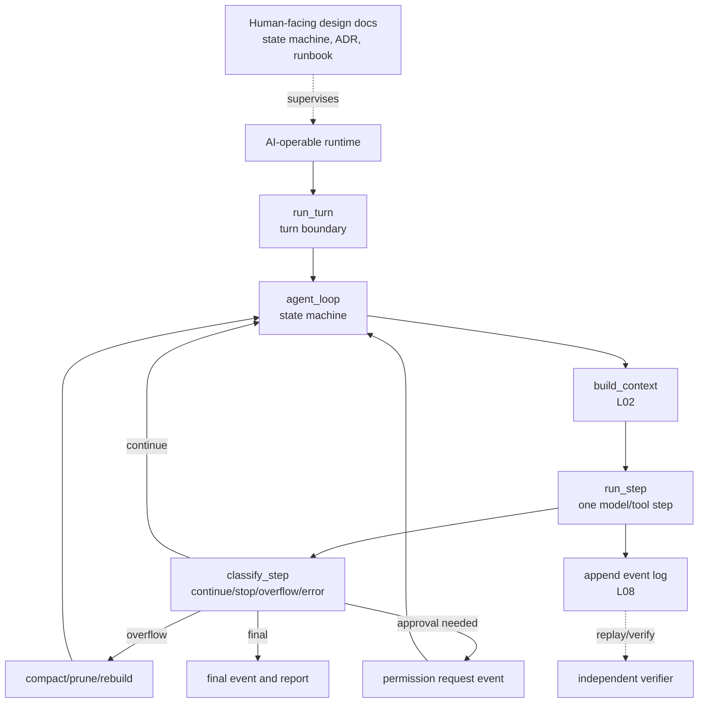

# P00 agent-loop evaluation

## Evaluation Premise

This is not a second evidence pass. The evidence source remains [P00-agent-loop-orchestrator.md](P00-agent-loop-orchestrator.md).

This is an evaluation pass under a corrected product premise:

- Coding work is performed by AI agents.
- Humans primarily inspect architecture documents, state diagrams, runbooks, evaluations, and execution evidence.
- The goal is not the smallest implementation. The goal is a better implementation: observable, replayable, verifiable, and safe to evolve by agents.

## What Changed

Earlier loop commentary used some human code-readability language. That is insufficient for this repo.

The better question is:

> Can an AI agent reliably operate, modify, verify, recover, and explain this loop while a human supervises through higher-level contracts and evidence?

## Evaluation Axes

| Axis | Meaning | Good Signal |
| --- | --- | --- |
| AI-operability | Can an agent locate, change, and test the loop without guessing? | Strong names, typed contracts, narrow modules, deterministic tests |
| Contract clarity | Are turn, step, event, tool, approval, and stop states explicit? | Small state/result types, clear transition points |
| Traceability | Can a run be reconstructed from emitted events? | Turn/step/tool/error/approval/compaction events |
| Replayability | Can prior state be resumed, replayed, forked, or audited? | Append-only log, checkpoint, context snapshot, replay API |
| Verification separability | Can verification be performed outside the same loop path? | Fake provider/tool tests, event snapshots, review hooks |
| Human abstraction quality | Can a human understand behavior from diagrams/docs/evidence without reading all code? | Lifecycle diagrams, ADRs, runbooks, summarized traces |
| Runtime/harness separation | Is the core loop independent of CLI/TUI/API rendering? | Headless runtime, surface adapters, protocol boundary |
| Change blast radius | Can a small behavior change stay local? | Orchestrator/executor/classifier split |
| Failure-state explicitness | Are abort, retry, denied approval, tool failure, overflow distinct? | Typed error/result states, clear recovery policy |
| Extension safety | Can hooks, skills, tools, and subagents extend without corrupting the loop? | Extension contracts, scoped permissions, isolation |

Scores below are Codex's interpretation based on the existing P00 evidence, not direct upstream claims.

Scale:

- 5: strong model for our target.
- 4: good pattern with manageable gaps.
- 3: usable but needs redesign guardrails.
- 2: valuable as reference but risky to adopt.
- 1: poor fit for the target.

## Score Matrix

| Project | AI-operability | Contract clarity | Traceability | Replayability | Verification separability | Human abstraction | Runtime/harness split | Blast radius | Failure states | Extension safety | Total |
| --- | ---: | ---: | ---: | ---: | ---: | ---: | ---: | ---: | ---: | ---: | ---: |
| openai/codex | 4 | 4 | 4 | 3 | 3 | 3 | 5 | 3 | 4 | 4 | 37 |
| NousResearch/hermes-agent | 2 | 2 | 3 | 3 | 2 | 3 | 2 | 2 | 4 | 3 | 26 |
| XiaomiMiMo/MiMo-Code | 4 | 4 | 4 | 4 | 3 | 2 | 4 | 4 | 5 | 4 | 38 |
| MoonshotAI/kimi-cli | 4 | 5 | 4 | 4 | 3 | 4 | 4 | 4 | 4 | 4 | 40 |

## Project Evaluation

### openai/codex

Confirmed basis:

- SDK `Thread.run()` and `Thread.turn()` are entry/control surfaces.
- Rust `run_turn()` is the core turn loop.
- `run_sampling_request()` and stream consumption handle model-stream execution and retry.

Strengths for our target:

- Strong runtime/harness separation. The SDK/app-server can be treated as surface/control, while Rust core owns turn execution.
- Typed runtime and protocol-oriented structure are favorable for AI-operated edits because state and message boundaries are less implicit.
- The loop already composes context, model call, tool runtime, retry, stop hooks, and turn events as runtime responsibilities.

Weaknesses for our target:

- Human abstraction quality is not automatic. Without a map, the SDK/app-server/protocol/Rust path is too deep for a human supervisor.
- Route tracing from `turn_start` to core operation still needs a tighter evidence pass.
- Verification separability was not fully evaluated in P00; do not assume complete replay/test quality from the loop location alone.

What to reuse:

- Keep core runtime separate from surface adapters.
- Use typed turn and stream contracts.
- Treat SDK/API as a control plane, not the loop owner.

What to avoid:

- Do not start with many protocol layers before the core state machine contract is legible.

### NousResearch/hermes-agent

Confirmed basis:

- `run_agent.AIAgent.run_conversation()` forwards to `agent.conversation_loop.run_conversation()`.
- `run_conversation()` contains turn setup, API retry/fallback, tool validation, tool execution, context compression, and final/continue decisions.

Strengths for our target:

- Excellent requirements inventory. It shows many real loop policies that a serious agent eventually needs: steer, retry, fallback, tool repair, context compression, guardrail halt, persistence, interrupt.
- Failure handling is rich and concrete.
- Useful for discovering edge cases that cleaner architectures may forget.

Weaknesses for our target:

- Too much policy is concentrated in one function. This increases change blast radius for AI edits.
- Contract boundaries are weaker: context, model request, tool validation, recovery, persistence, and UI-adjacent behavior are interleaved.
- Verification by independent components is harder when the loop is procedural rather than state/result-contract driven.

What to reuse:

- Use Hermes as a checklist of required loop scenarios.
- Mine its recovery branches for test cases.

What to avoid:

- Do not copy the "large loop owns everything" structure.

### XiaomiMiMo/MiMo-Code

Confirmed basis:

- CLI `run.ts` creates or resumes sessions, subscribes to events, and calls `session.prompt()` or `session.command()`.
- `SessionPrompt` owns a `while (true)` orchestration loop.
- `SessionProcessor.process()` drains one model/tool stream and returns `overflow`, `stop`, or `continue`.
- `classifyAssistantStep()` makes continuation decisions from assistant state and tool parts.

Strengths for our target:

- Strong orchestrator/executor split. `SessionPrompt` decides loop continuation; `SessionProcessor` handles one step.
- `continue | stop | overflow` is a useful small contract for agent-operable control.
- Classifier-based stop/continue decisions are a strong pattern for tests and AI edits.
- Message/session/event services suggest better traceability and replay potential than a single procedural loop.

Weaknesses for our target:

- Human abstraction quality is weak unless diagrams and contracts are provided. Effect/service layering hides the path.
- Surface-to-core routing needs clearer documentation.
- The architecture looks powerful but can become hard for a human to supervise without generated maps.

What to reuse:

- Split `run_turn_loop` from `run_step`.
- Use explicit `StepResult`/classification values.
- Keep overflow as a first-class continuation state, not a generic error.

What to avoid:

- Do not let framework abstraction become the only way to understand control flow.

### MoonshotAI/kimi-cli

Confirmed basis:

- `KimiCLI.run()` is a no-UI runner that yields wire messages.
- ACP session adapts `KimiCLI.run()` into ACP updates.
- `KimiSoul.run()` owns turn boundary and emits `TurnBegin`/`TurnEnd`.
- `_agent_loop()` is explicitly named as the main agent loop.
- `_step()` runs one model/tool step through `kosong.step()`, waits for tool results, grows context, and returns continue/stop behavior.

Strengths for our target:

- Best lifecycle vocabulary among the four: `run`, `_turn`, `_agent_loop`, `_step`, `TurnBegin`, `StepBegin`, `TurnEnd`.
- Strong human abstraction quality because the code names already match the conceptual model.
- Good separation between turn boundary, loop, step execution, and wire/surface adapters.
- Good model for human-facing diagrams and AI-facing function contracts.

Weaknesses for our target:

- The implementation has many surrounding runtime dependencies: wire, approval runtime, MCP loading, checkpointing, `kosong.step`.
- Verification separability was not proven in this pass.
- The architecture should be extracted into a clearer contract before adoption; do not inherit the whole ecosystem.

What to reuse:

- Turn/step naming.
- Turn events and wire-message boundary.
- `_agent_loop()` plus `_step()` mental model.

What to avoid:

- Do not make the first implementation depend on too many runtime services before the state machine contract is stable.

## Target Architecture Implications

The best target is a synthesis, not a copy.



Recommended synthesis:

- From Kimi: lifecycle vocabulary and turn/step mental model.
- From MiMo: orchestrator/executor/classifier split and explicit `continue | stop | overflow` contract.
- From Codex: typed runtime/surface separation and turn-stream runtime rigor.
- From Hermes: exhaustive policy checklist and real-world recovery cases.

## Proposed Better Loop Contract

The new agent should be designed around contracts a coding agent can edit safely and a human can inspect abstractly.

```text
run_turn(input, runtime_config) -> TurnReport
  emits TurnStarted
  appends normalized user input
  calls agent_loop
  emits TurnCompleted | TurnFailed | TurnInterrupted

agent_loop(turn_state) -> TurnOutcome
  repeat:
    context = build_context(turn_state)
    step = run_step(context)
    append step events
    decision = classify_step(step, turn_state)

    if decision == Continue:
      continue
    if decision == NeedApproval:
      emit PermissionRequested
      wait or suspend
    if decision == Overflow:
      compact_or_rebuild
      continue
    if decision == Retry:
      retry according to policy
    if decision == Final:
      return final
    if decision == Failed:
      return failure with evidence
```

Minimum state/result types for a better implementation:

```text
TurnState
StepInput
StepResult
LoopDecision
ToolCallRequest
ToolObservation
PermissionRequest
RuntimeEvent
VerificationEvidence
TurnReport
```

## Evaluation Conclusions

- Best conceptual model: MoonshotAI/kimi-cli.
- Best structural split: XiaomiMiMo/MiMo-Code.
- Best runtime/surface separation signal: openai/codex.
- Best edge-case inventory: NousResearch/hermes-agent.

The target should not optimize for code that a human manually reads end-to-end. It should optimize for:

- AI agents can navigate and modify modules safely.
- Humans can inspect diagrams, contracts, state transitions, and execution evidence.
- Every turn can be replayed or audited.
- Verification is a separate observer, not only the same loop declaring success.

## Next Actions

1. Add `P00 target loop contract` as an ADR or design note.
2. Use L08, L01, and L06 as the next evidence passes:
   - L08: how the loop is persisted, replayed, forked, and audited.
   - L01: how requests enter this loop.
   - L06: how risky actions pause, request approval, and resume.
