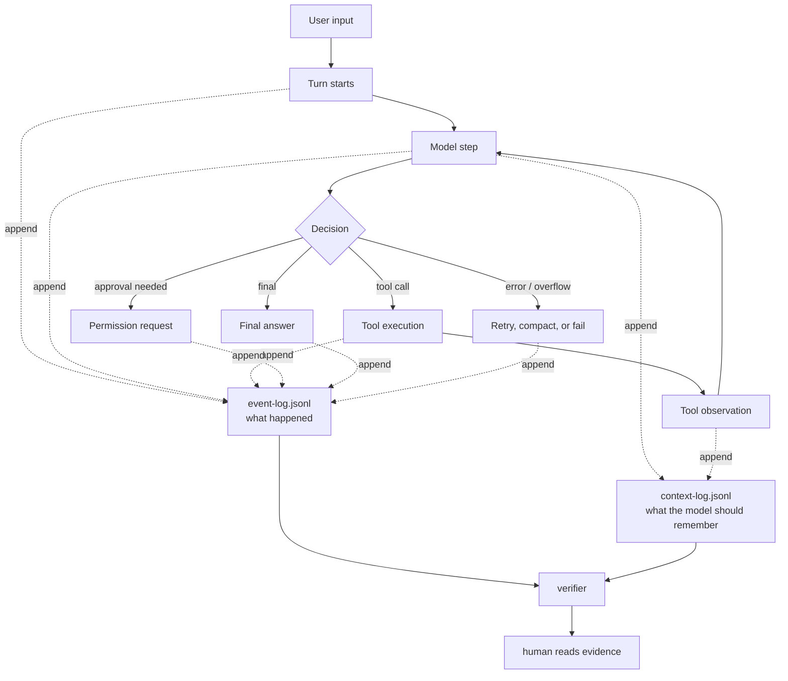
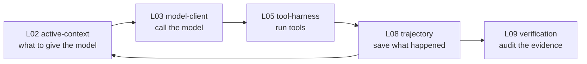

# L08 Trajectory Feynman Guide

## 1. 한 문장

L08 `trajectory`는 에이전트가 한 일을 나중에 다시 볼 수 있게 남기는 블랙박스 기록입니다.

조금 더 정확히 말하면, 사람이 읽는 대화 기록, 모델에게 다시 넣는 context 기록, 검증자가 보는 실행 증거를 분리해서 저장하는 계층입니다.

## 2. 아주 쉬운 비유

에이전트를 택배 기사라고 해봅시다.

- 사용자는 “이 물건을 배송해줘”라고 말합니다.
- 기사는 창고에 가고, 스캐너를 찍고, 주소를 확인하고, 중간에 연락을 하고, 배송을 완료합니다.
- 나중에 문제가 생기면 “기사가 완료라고 말했다”만으로는 부족합니다.
- 우리는 이동 기록, 스캔 기록, 사진, 서명, 실패 사유를 봐야 합니다.

에이전트도 같습니다.

```text
최종 답변 = "배송 완료했습니다"
trajectory = 언제 무엇을 보고, 어떤 도구를 썼고, 무엇이 실패했고, 왜 멈췄는지 남긴 전체 기록
```

그래서 L08은 “대화 저장”이 아니라 “재현 가능한 실행 증거”입니다.

## 3. 왜 지금 L08인가

모델 프록시부터 붙이면 이런 일이 생깁니다.

```text
모델 요청이 실패함
-> 어떤 메시지 순서였지?
-> 도구 결과가 빠졌나?
-> 승인 대기였나?
-> context 압축 후 이어진 건가?
-> 최종 답변은 믿어도 되나?
```

이 질문에 답하려면 먼저 trajectory가 있어야 합니다.

따라서 순서는 이쪽이 더 안전합니다.

```text
P00 loop 계약
-> L08 trajectory 원장
-> fake model / fake tool replay 검증
-> 그 다음 L03 model-client
```

## 4. 핵심 그림



이 그림의 핵심은 두 개입니다.

- `event-log.jsonl`: 실제로 무슨 일이 일어났는지 남기는 기록
- `context-log.jsonl`: 다음 모델 호출에 무엇을 다시 넣을지 남기는 기록

둘은 비슷해 보이지만 목적이 다릅니다.

## 5. 사람이 읽을 때 보는 것

사람이 매번 코드를 읽을 필요는 없습니다. 대신 아래 네 가지를 봅니다.

| 사람이 보는 것 | 쉬운 의미 | 질문 |
| --- | --- | --- |
| Contract | 이 시스템이 지키기로 한 약속 | 어떤 사건을 반드시 기록해야 하나? |
| Event log | 실제 실행 기록 | 어떤 순서로 일이 일어났나? |
| Verification evidence | 별도 검증 결과 | 완료 주장을 믿어도 되나? |
| Final report | 사용자용 요약 | 무엇이 바뀌었고, 무엇이 남았나? |

이 관점에서는 “코드가 예쁜가”보다 “나중에 확인 가능한가”가 더 중요합니다.

## 6. 네 repo를 아주 간단히

| Project | 한 줄 요약 | 우리가 배울 점 |
| --- | --- | --- |
| openai/codex | rollout 원장에서 history를 다시 조립한다 | 원본 event 원장을 남겨야 한다 |
| Hermes Agent | SQLite로 session/message를 저장하고 검색한다 | 장기 운영에는 검색 가능한 DB가 필요하다 |
| MiMo-Code | message와 part를 나누고 event seq로 replay한다 | 장기 목표는 event-sourced + projection 구조가 좋다 |
| Kimi CLI | `context.jsonl`과 `wire.jsonl`을 분리한다 | 첫 구현은 JSONL 두 파일로 시작하기 좋다 |

## 7. 왜 그냥 messages 배열이면 안 되나

처음에는 이렇게 하고 싶어집니다.

```ts
messages = [
  { role: "user", content: "고쳐줘" },
  { role: "assistant", content: "tool call" },
  { role: "tool", content: "result" },
  { role: "assistant", content: "완료" }
]
```

하지만 실제 에이전트에는 이런 일이 생깁니다.

- 도구 호출은 했지만 승인 대기 중이다.
- 도구 결과가 너무 커서 압축했다.
- 중간에 사용자가 중단했다.
- context overflow가 났다.
- 이전 세션에서 resume했다.
- fork해서 다른 방향으로 이어갔다.
- assistant tool call은 있는데 tool result가 빠졌다.

이런 상태는 단순 messages 배열만으로는 안전하게 설명하기 어렵습니다.

## 8. 가장 중요한 불변식

L08에서 제일 중요한 규칙은 이것입니다.

```text
tool call과 tool result는 절대 찢어지면 안 된다.
```

예를 들어 모델에게 이런 history를 다시 보내면 위험합니다.

```text
assistant: "search tool을 호출하겠다"  toolCallId=abc
assistant: "그 결과로 답하면..."      <- tool result가 없음
```

모델 provider는 이런 history를 거절할 수 있고, 더 나쁘게는 verifier가 “무슨 일이 실제로 일어났는지” 확인할 수 없습니다.

그래서 checkpoint, compaction, resume, replay는 모두 이 쌍을 보존해야 합니다.

## 9. 우리가 만들 목표 모양

처음 구현은 이렇게 작게 갑니다.

```text
runs/<run-id>/
  event-log.jsonl
  context-log.jsonl
  turn-report.json
  verification-report.json
```

각 파일의 역할:

| File | 역할 | 사람이 봐야 하나 |
| --- | --- | --- |
| `event-log.jsonl` | turn, step, tool, approval, retry, final 사건 원장 | 문제 생기면 본다 |
| `context-log.jsonl` | 모델에게 다시 넣을 기억 | 보통 verifier가 본다 |
| `turn-report.json` | runtime이 만든 결과 요약 | 참고만 한다 |
| `verification-report.json` | 별도 verifier 판정 | 사람이 우선 본다 |

중요한 말:

```text
turn-report는 주장이고, verification-report는 판정이다.
```

## 10. 최소 이벤트 예시

```jsonl
{"seq":0,"type":"TurnStarted","turnId":"turn_1"}
{"seq":1,"type":"StepStarted","turnId":"turn_1","stepId":"step_1"}
{"seq":2,"type":"ModelStepCompleted","stepId":"step_1"}
{"seq":3,"type":"ToolCallRequested","toolCallId":"call_1","name":"read_file"}
{"seq":4,"type":"ToolCompleted","toolCallId":"call_1"}
{"seq":5,"type":"StepStarted","turnId":"turn_1","stepId":"step_2"}
{"seq":6,"type":"ModelStepCompleted","stepId":"step_2"}
{"seq":7,"type":"TurnCompleted","turnId":"turn_1"}
```

사람이 봐야 하는 것은 JSON 문법이 아니라 순서입니다.

```text
시작했다
-> 모델이 판단했다
-> 도구를 요청했다
-> 도구가 끝났다
-> 다시 모델이 판단했다
-> 끝났다
```

## 11. L08과 다른 레이어의 경계



짧게 말하면:

- L02는 “무엇을 기억으로 넣을까?”
- L03은 “어떤 모델에게 어떻게 보낼까?”
- L05는 “도구를 어떻게 실행할까?”
- L08은 “무슨 일이 있었다고 남길까?”
- L09는 “그 기록을 믿어도 되나?”

## 12. 구현 전에 사람이 승인해야 할 판단

다음 코드 작업 전에 사람이 볼 판단은 세 가지입니다.

1. `event-log.jsonl`과 `context-log.jsonl`을 분리한다.
2. 첫 구현은 SQLite가 아니라 append-only JSONL로 한다.
3. verifier는 runtime 내부 판정이 아니라 저장된 log를 다시 읽어 판정한다.

이 세 가지가 맞으면 바로 L08 vertical slice를 만들 수 있습니다.

## 13. 5분 자기 점검

아래 질문에 답할 수 있으면 L08을 이해한 것입니다.

- L08은 왜 단순 대화 저장이 아닌가?
- `event-log.jsonl`과 `context-log.jsonl`은 왜 분리해야 하나?
- 왜 L03 model-client보다 L08을 먼저 구현하는가?
- `turn-report`와 `verification-report`는 어떻게 다른가?
- tool call과 tool result가 찢어지면 어떤 문제가 생기는가?
- SQLite를 지금 당장 쓰지 않고 JSONL로 시작하는 이유는 무엇인가?

## 14. 다음에 읽을 것

- 연구 원장: [L08 Trajectory](../docs/research/layers/L08-trajectory.md)
- 이전 단계: [P00 Agent Loop Feynman Guide](p00-agent-loop-feynman-guide.md)
- 설계 계약: [P00 Target Loop Contract](../docs/design/P00-target-loop-contract.md)

