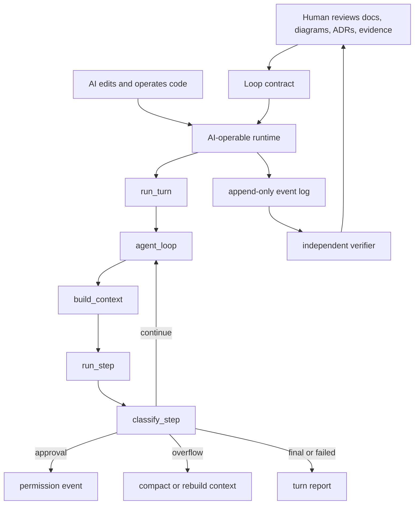

# P00 agent-loop evaluation brief

## One Sentence

좋은 코딩 에이전트 루프는 사람이 모든 소스를 직접 읽는 구조가 아니라, AI가 안전하게 운용ㆍ수정ㆍ검증할 수 있고 사람은 설계 계약, 상태도, 실행 증거로 감독할 수 있는 구조다.

## Corrected Goal

이번 평가는 "가장 작게 만들기"가 아니라 "처음부터 더 나은 에이전트를 만든다면 어떤 루프 계약이 필요한가"를 기준으로 한다.

- 전제 1: 코딩 작업은 AI가 한다.
- 전제 2: 인간은 코드 전체가 아니라 추상화된 설계, 문서, 상태 전이, 실행 증거를 본다.
- 결론: 루프의 품질은 코드 줄 수보다 관찰성, 재현성, 검증 분리, 실패 상태의 명시성으로 평가해야 한다.

## Evaluation Result

아래 점수는 [P00-agent-loop-evaluation.md](../docs/research/layers/P00-agent-loop-evaluation.md)에 정리한 Codex의 해석이다. 원본 프로젝트의 공식 주장이나 벤치마크가 아니라, 기존 P00 증거 노트를 바탕으로 한 설계 적합도 평가다.

| Project | Best Signal | Risk | Score |
| --- | --- | --- | ---: |
| MoonshotAI/kimi-cli | `run`, `_agent_loop`, `_step`, `TurnBegin`, `StepBegin`처럼 생명주기 이름이 개념과 잘 맞는다. | 주변 런타임 의존성을 그대로 가져오면 초기 구현이 무거워질 수 있다. | 40 |
| XiaomiMiMo/MiMo-Code | orchestrator, processor, classifier가 나뉘고 `continue`, `stop`, `overflow` 결정이 명시적이다. | Effect/service 계층이 문서화되지 않으면 사람에게는 경로가 숨겨진다. | 38 |
| openai/codex | core runtime과 surface/API 경계가 강하고 typed stream/turn 구조가 좋다. | SDK, app-server, protocol, Rust core 경로를 사람이 이해하려면 별도 맵이 필요하다. | 37 |
| NousResearch/hermes-agent | 실제 에이전트 루프에서 필요한 retry, fallback, compression, interruption, persistence 사례가 풍부하다. | 큰 함수가 너무 많은 정책을 소유하면 AI가 변경할 때 blast radius가 커진다. | 26 |

## What To Reuse

- Kimi에서 가져올 것: `turn -> loop -> step` 생명주기 어휘와 이벤트 이름.
- MiMo에서 가져올 것: loop orchestrator, one-step executor, step classifier의 분리.
- Codex에서 가져올 것: surface와 runtime을 분리하고, typed turn/stream 계약을 먼저 세우는 방식.
- Hermes에서 가져올 것: 실패ㆍ복구ㆍ압축ㆍ중단ㆍ도구 수리 같은 운영 시나리오 체크리스트.

## What Not To Copy

- 전체 생태계를 통째로 복사하지 않는다.
- 하나의 거대한 loop 함수가 context, model, tool, approval, persistence, recovery를 모두 소유하게 만들지 않는다.
- UI/TUI/surface가 permission, tool execution, model step의 소유자가 되지 않게 한다.
- 사람이 소스를 전부 읽어야만 안전성을 판단할 수 있는 구조를 목표로 삼지 않는다.

## Target Loop Shape



## Minimum Contract

처음부터 아래 타입 또는 동등한 문서 계약을 둔다.

```text
TurnState
StepInput
StepResult
LoopDecision
ToolCallRequest
ToolObservation
PermissionRequest
RuntimeEvent
VerificationEvidence
TurnReport
```

권장 흐름:

```text
run_turn(input, runtime_config) -> TurnReport
  normalize input
  emit TurnStarted
  call agent_loop
  emit TurnCompleted | TurnFailed | TurnInterrupted

agent_loop(turn_state) -> TurnOutcome
  repeat:
    context = build_context(turn_state)
    step = run_step(context)
    append step events
    decision = classify_step(step, turn_state)
    continue | approval | overflow | retry | final | failed
```

## Next Best Step

P00은 이제 "어떤 루프를 만들 것인가"의 기준점으로 사용할 수 있다. 다음 분석은 레이어 번호 순서보다 구현 설계상 더 중요한 순서로 가는 것이 좋다.

1. L08 `trajectory`: event log, checkpoint, replay, fork, resume를 먼저 본다.
2. L01 `intent-intake`: 사용자의 입력이 어떤 `TurnState`로 들어오는지 본다.
3. L06 `approval-policy`: 위험 작업이 루프 안에서 어떻게 멈추고 재개되는지 본다.

함께 볼 자료:

- [P00 Agent Loop Feynman Guide](p00-agent-loop-feynman-guide.md)
- [P00 Agent Loop Evaluation](../docs/research/layers/P00-agent-loop-evaluation.md)
