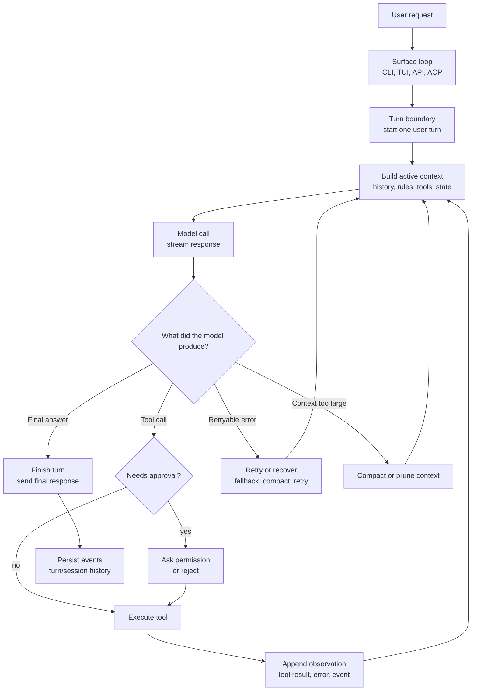
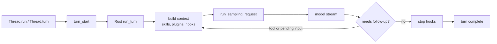
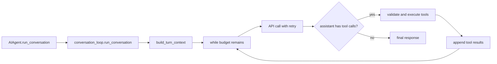
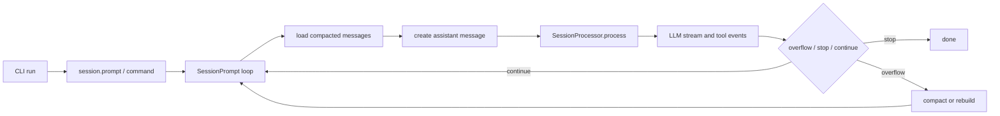
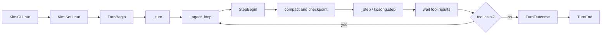
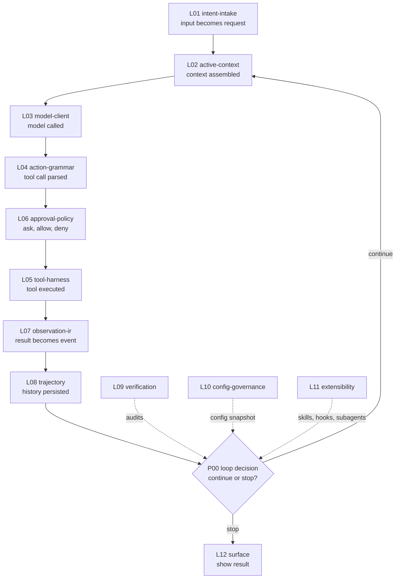

# P00 Agent Loop Feynman Guide

## 1. 한 문장

코딩 에이전트의 loop는 사용자의 요청을 받은 뒤, 모델에게 물어보고, 모델이 도구를 쓰라고 하면 도구를 실행하고, 그 결과를 다시 모델에게 보여주며, 더 할 일이 없을 때 멈추는 반복 구조입니다.

## 2. 아주 작은 mental model

에이전트를 "작업 접수대와 작업대가 있는 팀"으로 보면 쉽습니다.

- 사용자는 접수대에 요청을 냅니다.
- 접수대는 요청을 작업 카드로 만듭니다.
- 작업대는 현재 자료, 규칙, 이전 대화를 모아 모델에게 줍니다.
- 모델은 말하거나, 도구 사용을 요청합니다.
- 도구를 쓰면 결과가 다시 작업대에 붙습니다.
- 작업대는 다시 모델에게 물어볼지, 이제 끝낼지 결정합니다.

여기서 중요한 점은 하나입니다.

도구 실행은 끝이 아닙니다. 도구 결과를 다시 모델에게 먹이는 다음 반복의 재료입니다.

## 3. 공통 loop 그림

이 그림에서 P00가 보는 것은 한 칸의 내부 구현이 아니라, 칸들이 어떤 순서로 움직이는지입니다.

## 4. Loop는 하나가 아니라 둘입니다

대부분의 코딩 에이전트에는 loop가 두 종류 있습니다.

| Loop | 쉬운 설명 | 주로 하는 일 | 헷갈리면 안 되는 점 |
| --- | --- | --- | --- |
| Surface loop | 사람과 화면을 상대하는 loop | 입력 받기, 이벤트 보여주기, 승인 UI, 스트림 출력 | 보이는 loop일 뿐, 항상 core 판단을 하지는 않음 |
| Core agent loop | 실제 작업 판단 loop | 모델 호출, 도구 요청 처리, 결과 반영, 계속/종료 결정 | P00의 중심 분석 대상 |

따라서 코드에서 `while`, `stream`, `event`를 찾았다고 바로 agent loop라고 보면 안 됩니다.  
"이 loop가 다음 모델 호출 여부를 결정하는가?"를 물어봐야 합니다.

## 5. 네 repo 한눈에 보기

| Project | Surface entry | Core loop | One-step executor | Stop decision |
| --- | --- | --- | --- | --- |
| openai/codex | Python SDK `Thread.run()` / `Thread.turn()` | Rust `run_turn()` | `run_sampling_request()` / stream consumer | follow-up 없음, stop hook 통과 |
| Hermes Agent | CLI / `AIAgent.run_conversation()` forwarder | `agent.conversation_loop.run_conversation()` | 같은 함수 안의 API call + tool execution | tool call 없음, budget/error/interrupt |
| MiMo-Code | CLI `run.ts`, SDK `session.prompt()` | `session/prompt.ts`의 `while (true)` | `session/processor.ts::process()` | `classifyAssistantStep()` 결과 |
| Kimi CLI | `KimiCLI.run()`, ACP adapter | `KimiSoul._agent_loop()` | `KimiSoul._step()` / `kosong.step()` | tool call 없음 또는 max/failure |

## 6. Repo별 그림

### openai/codex

파인만식 설명: Codex는 "턴 실행 엔진"이 Rust에 있습니다. Python SDK는 시작 버튼에 가깝고, 실제 반복 판단은 `run_turn()`이 합니다.

### NousResearch/hermes-agent

파인만식 설명: Hermes는 큰 작업대 하나에 많은 규칙이 붙어 있습니다. context 준비, API 재시도, 도구 검증, 도구 실행, 압축, 종료 판단이 한 큰 함수 안에서 이어집니다.

### XiaomiMiMo/MiMo-Code

파인만식 설명: MiMo는 지휘자와 연주자가 나뉩니다. `SessionPrompt`가 다음 반복 여부를 판단하고, `SessionProcessor`가 한 번의 모델/도구 스트림을 처리합니다.

### MoonshotAI/kimi-cli

파인만식 설명: Kimi는 이름이 가장 친절합니다. `_agent_loop()`가 전체 반복이고, `_step()`은 그 안의 한 번짜리 모델 호출과 도구 처리입니다.

## 7. P00가 알려주는 것

P00는 "어느 파일이 제일 중요한가"를 찾는 작업이 아닙니다.  
P00는 "한 턴이 살아 움직이는 순서"를 찾는 작업입니다.

좋은 agent loop는 다음 질문에 답할 수 있어야 합니다.

- 어디서 turn이 시작되는가?
- 모델 호출 전에 어떤 context를 조립하는가?
- 모델이 도구를 부르면 누가 검증하는가?
- 도구 결과는 어디에 저장되고, 다음 모델 호출에 어떻게 들어가는가?
- 누가 계속할지 멈출지 판단하는가?
- 실패, 취소, 승인 거절, context overflow는 같은 실패인가, 다른 상태인가?
- 중단 후 다시 시작할 수 있는 기록은 어디에 남는가?

## 8. P00와 12계층

P00는 12계층 중 하나가 아닙니다.  
P00는 12계층이 한 턴 안에서 어떤 순서로 호출되는지 보는 관찰 축입니다.

## 9. 처음 읽는 순서

1. 이 문서의 그림만 먼저 봅니다.
2. "도구 실행은 끝이 아니라 다음 모델 호출의 재료"라는 문장을 외웁니다.
3. 네 repo 표에서 core loop 파일명만 봅니다.
4. 그다음 원장 문서 [P00-agent-loop-orchestrator.md](../docs/research/layers/P00-agent-loop-orchestrator.md)의 matrix를 봅니다.
5. 소스 코드는 마지막에, line reference가 있는 부분만 봅니다.

## 10. 5분 자기 점검

아래 질문에 답할 수 있으면 P00를 이해한 것입니다.

- surface loop와 core loop의 차이는 무엇인가?
- 왜 tool result 뒤에 다시 model call이 필요한가?
- Kimi의 `_agent_loop()`와 `_step()`은 어떻게 다른가?
- MiMo의 `SessionPrompt`와 `SessionProcessor`는 어떻게 역할이 다른가?
- Hermes는 왜 이해하기 쉽지만 분리 관점에서는 위험할 수 있는가?
- OpenAI Codex에서 SDK와 Rust core는 각각 어떤 역할인가?

## 11. 유용한 shortcut 하나

새 repo를 분석할 때는 먼저 이 질문 하나만 던지면 됩니다.

> "모델이 도구를 부른 뒤, 도구 결과를 다시 모델에게 먹이는 코드는 어디인가?"

그 위치가 보통 P00 core loop입니다.
